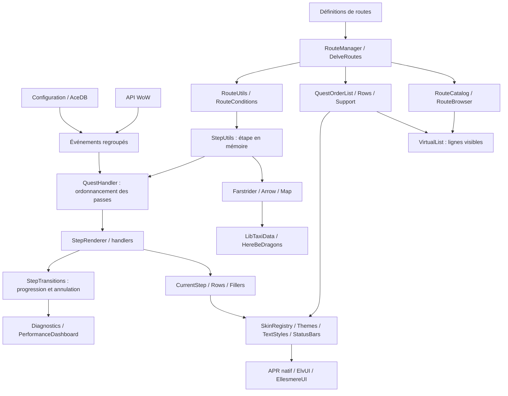

# APR-Core : architecture et audit

Audit du 8 octobre 2026. Périmètre : **89 fichiers Lua propres au cœur**, 11
entrées de localisation, médias et dépendances chargées. Les définitions de
`Routes/` servent à vérifier les consommateurs ; seules les métadonnées d'auteur
et de communauté de la route EclipseGlaives sont ajoutées, à la demande du mainteneur.
Les changements extérieurs au cœur concernent le manifeste, les tests et les
références de validation nécessaires aux déplacements.

Principe de maintenance : **lisibilité, lisibilité, lisibilité**. Un helper est
partagé lorsqu'il exprime le même contrat pour plusieurs consommateurs. Les
contrôleurs de fenêtres, abonnements et états métier restent dans leur domaine.
Les commentaires expliquent les contraintes et effets de bord ; ils ne répètent
pas les noms des accesseurs.

## Chargement et circulation des données

[`APR.toc`](../APR.toc) définit l'ordre de chargement. Les dossiers décrivent les
responsabilités, pas cet ordre : une fonction peut référencer un module chargé
plus tard si elle n'est appelée qu'après l'initialisation.

1. Bibliothèques, données Farstrider sélectionnées par client et AceLocale.
2. `SecretUtils`, création de l'objet AceAddon `APR`, registre des skins et adaptateur taxi.
3. Helpers, fondations visuelles, moteur de routes et modèles.
4. Configuration, événements, fonctionnalités, fenêtres et intégrations visuelles.
5. Enregistrement des routes du client, puis appel AceAddon à `OnInitialize`.
6. Identité, AceDB et sauvegardes, puis initialisation des fenêtres et abonnements.



`GetRouteSteps` construit la liste effective : scénarios, groupes parallèles et
routes temporaires. `GetStep` renvoie une copie superficielle pour les ajustements
de navigation. `GetCurrentStep` résout la progression sauvegardée et partage cette
copie avec la flèche et les événements. **Les tables imbriquées d'une définition
restent en lecture seule.**

## Cartographie des fichiers

### Initialisation et configuration

| Fichier | Responsabilité |
| --- | --- |
| [core/Core.lua](core/Core.lua) | Objet AceAddon, identité, sauvegardes et initialisation des modules. |
| [core/Event.lua](core/Event.lua) | Événements, regroupement des notifications et callbacks différés. |
| [core/Commands.lua](core/Commands.lua) | Routage des commandes `/apr` vers leurs modules. |
| [core/Performance.lua](core/Performance.lua) | Capture volontaire : agrégats, histogrammes, appels lents et compteurs bornés. |
| [core/VersionCheck.lua](core/VersionCheck.lua) | Versions client/addon et annonces au groupe, sans requêtes web. |
| [config/Config.lua](config/Config.lua) | Défauts AceDB, options AceConfig, profils et bouton de minicarte. |
| [config/SettingsIndex.lua](config/SettingsIndex.lua) | Index des options AceConfig ; réutilise leurs setters, conditions et descriptions. |
| [config/Config_Route.lua](config/Config_Route.lua) | Notifications de parcours/catalogue et entrée AceConfig vers la bibliothèque unique. |
| [config/Config_Route_Prefabs.lua](config/Config_Route_Prefabs.lua) | Parcours prédéfinis construits depuis les métadonnées et conditions. |
| [config/LevelProfiles.lua](config/LevelProfiles.lua) | Données des bonus XP et profils de seuils ; aucun rendu. |

### Modèles

| Fichier | Responsabilité |
| --- | --- |
| [data/models/Classes.lua](data/models/Classes.lua) | Identifiants classe/spécialisation et clés de routes indépendantes de la langue. |
| [data/models/Enums.lua](data/models/Enums.lua) | Clients, catégories, extensions et ordres partagés. |
| [data/models/Quest.lua](data/models/Quest.lua) | Priorité des actions principales et règles quêtes/dialogues. |
| [data/models/Spells.lua](data/models/Spells.lua) | Correspondances objets/sorts des pierres de foyer, jouets et buffs. |
| [data/zones/ScenarioEntrances.lua](data/zones/ScenarioEntrances.lua) | Entrées de scénarios pour le guidage extérieur. |

### Fonctionnalités et moteur de routes

| Fichier | Responsabilité et contrat |
| --- | --- |
| [features/questing/RouteManager.lua](features/questing/RouteManager.lua) | Compatibilité, prérequis et cache des étapes effectives ; visibilité distincte de disponibilité. |
| [features/questing/DelveRoutes.lua](features/questing/DelveRoutes.lua) | Gouffres, scénarios et insertion/restauration des routes temporaires. |
| [features/questing/RouteSuggestions.lua](features/questing/RouteSuggestions.lua) | Index des premières quêtes déclenchant une suggestion de route. |
| [features/questing/QuestHandler.lua](features/questing/QuestHandler.lua) | Ordonnancement par lots, transaction de rendu et rejet des callbacks obsolètes. |
| [features/questing/QuestCache.lua](features/questing/QuestCache.lua) | Synchronisation du journal et des événements de quêtes. |
| [features/questing/StepRenderer.lua](features/questing/StepRenderer.lua) | Orchestration d'une passe, avec la priorité des actions existantes. |
| [features/questing/StepInstructions.lua](features/questing/StepInstructions.lua) | Instructions additionnelles, boutons et choix de quêtes de groupe. |
| [features/questing/StepQuestHandlers.lua](features/questing/StepQuestHandlers.lua) | Acceptation, objectifs, abandon et restitution. |
| [features/questing/StepTravelHandlers.lua](features/questing/StepTravelHandlers.lua) | Foyer, portails, points de passage, taxi et scénarios. |
| [features/questing/StepActionHandlers.lua](features/questing/StepActionHandlers.lua) | Argent, objets/sorts, trésors, groupes et hauts faits. |
| [features/questing/StepTransitions.lua](features/questing/StepTransitions.lua) | Écriture de progression, contexte révisionné, historique et dernier saut annulable. |
| [features/questing/StepDiagnostics.lua](features/questing/StepDiagnostics.lua) | Raisons d'attente à partir d'un instantané, sans exécuter le moteur. |
| [features/questing/RouteCatalog.lua](features/questing/RouteCatalog.lua) | Recherche, provenance, disponibilité, favoris et mutations du parcours avec prérequis. |
| [features/questing/RouteActions.lua](features/questing/RouteActions.lua) | Inventaire, banque, réparation, apprentissage, mort et domptage ; vérification du contexte avant action. |
| [features/questing/Gossip.lua](features/questing/Gossip.lua) | Dialogues automatiques, règles NPC et délais. |
| [features/navigation/Arrow.lua](features/navigation/Arrow.lua) | Orientation, distance, visibilité et arrivée, à cadence configurable. |
| [features/navigation/FlightPath.lua](features/navigation/FlightPath.lua) | Découvertes taxi et sélection du vol demandé par la route. |
| [features/navigation/Map.lua](features/navigation/Map.lua) | Marqueurs et lignes carte/minicarte avec HereBeDragons. |
| [features/navigation/WorldCoordinateConverter.lua](features/navigation/WorldCoordinateConverter.lua) | Conversion/export auteur sur copie détachée ; géométrie des zones de collecte. |
| [features/player/AFK.lua](features/player/AFK.lua) | Compte à rebours et ancrage ; aucun `OnUpdate` une fois arrêté. |
| [features/player/Buff.lua](features/player/Buff.lua) | Buffs de route via AuraContainer ou requêtes individuelles selon les capacités. |
| [features/player/Heirloom.lua](features/player/Heirloom.lua) | Rappels héritages/enchantements et boutons sécurisés réutilisés. |
| [features/player/XPBuffOverlay.lua](features/player/XPBuffOverlay.lua) | Rappels XP applicables, actions sécurisées et masquage persistant. |
| [features/player/Cutscenes.lua](features/player/Cutscenes.lua) | Films/cinématiques ; modificateurs, réglages et `Dontskipvid`. |
| [features/group/Party.lua](features/group/Party.lua) | Progression du groupe, envoi limité en fréquence et fragments entrants. |
| [features/group/PartyProtocol.lua](features/group/PartyProtocol.lua) | Validation/copie des champs consommés, expéditeur réel et coût borné. |

### Intégrations

| Fichier | Frontière externe |
| --- | --- |
| [integrations/TaxiData.lua](integrations/TaxiData.lua) | Façade `LibTaxiData_API`, contrôle des capacités et diagnostic au login. |
| [integrations/Farstrider.lua](integrations/Farstrider.lua) | Graphe vers instructions/flèche, cache des chemins et prédicats de compatibilité. |
| [integrations/ForeverTravel.lua](integrations/ForeverTravel.lua) | Liaisons aériennes observées sur Forever, propres au personnage. |
| [integrations/SkinRegistry.lua](integrations/SkinRegistry.lua) | Registre faible des contrôles APR, fournisseur unique et application hors combat. |
| [integrations/ElvUISkin.lua](integrations/ElvUISkin.lua) | Apparence ElvUI et fonds des panneaux ancrés. |
| [integrations/EllesmereUISkin.lua](integrations/EllesmereUISkin.lua) | API publique EUI, polices et couleurs du thème actualisées. |
| [integrations/EllesmereUISettings.lua](integrations/EllesmereUISettings.lua) | Pool AceGUI privé : le skin APR ne se propage pas aux autres addons. |

### Interface

| Fichier | Responsabilité et contrat |
| --- | --- |
| [ui/foundations/TextStyles.lua](ui/foundations/TextStyles.lua) | Héritage des styles, couleurs sémantiques et registre faible des textes/tooltips. |
| [ui/foundations/StatusBars.lua](ui/foundations/StatusBars.lua) | Barres natives ; APR possède les couleurs, les skins fournissent la texture. |
| [ui/foundations/InterfaceStrings.lua](ui/foundations/InterfaceStrings.lua) | Libellés FR/EN des nouvelles interfaces, surcharge AceLocale `UI_*` possible. |
| [ui/foundations/Themes.lua](ui/foundations/Themes.lua) | Quatre thèmes natifs et restitution des fonds/couleurs demandés. |
| [ui/foundations/Widgets.lua](ui/foundations/Widgets.lua) | Fenêtres persistantes, boutons, recherche, menus, infobulles et texte copiable partagés. |
| [ui/foundations/VirtualList.lua](ui/foundations/VirtualList.lua) | Indexation des hauteurs et recyclage des seules lignes visibles. |
| [ui/route/CurrentStep.lua](ui/route/CurrentStep.lua) | Fenêtre, barres, boutons sécurisés et changements différés après combat. |
| [ui/route/CurrentStepRows.lua](ui/route/CurrentStepRows.lua) | Transactions, rapprochement par clé, recyclage et disposition des lignes. |
| [ui/route/CurrentStepImagePreview.lua](ui/route/CurrentStepImagePreview.lua) | Miniatures et fenêtres réutilisées ; zoom, déplacement et ratio réel. |
| [ui/route/FillersFrame.lua](ui/route/FillersFrame.lua) | Objectifs facultatifs, transaction de contenu et ancrage des panneaux. |
| [ui/route/QuestOrderList.lua](ui/route/QuestOrderList.lua) | Modèles construits par lots, publication atomique et seules lignes visibles instanciées. |
| [ui/route/QuestOrderListRows.lua](ui/route/QuestOrderListRows.lua) | Présentation des actions futures, sans exécuter d'action métier. |
| [ui/route/QuestOrderListSupport.lua](ui/route/QuestOrderListSupport.lua) | Mesure partagée des modèles, lignes réutilisables, coroutine, réputation et défilement. |
| [ui/route/QuestionPopUp.lua](ui/route/QuestionPopUp.lua) | Confirmations, saisies et sélections avec callbacks renouvelés. |
| [ui/route/RouteSelection.lua](ui/route/RouteSelection.lua) | Invitation au choix d'une route quand le parcours est inutilisable. |
| [ui/route/RouteBrowser.lua](ui/route/RouteBrowser.lua) | Bibliothèque redimensionnable, fiche route, filtres, communauté et parcours ordonné. |
| [ui/panels/Coordinates.lua](ui/panels/Coordinates.lua) | Coordonnées destinées aux auteurs et position de fenêtre sauvegardée. |
| [ui/panels/ChangeLog.lua](ui/panels/ChangeLog.lua) | Notes de version et mise en forme. |
| [ui/panels/SettingsHome.lua](ui/panels/SettingsHome.lua) | Réglages essentiels, recherche et accès aux outils. |
| [ui/panels/LayoutEditor.lua](ui/panels/LayoutEditor.lua) | Contours indépendants ; annulation sans mutation, sauvegarde LibWindow hors combat. |
| [ui/panels/Diagnostics.lua](ui/panels/Diagnostics.lua) | Rapport copiable, identité facultative, raisons d'attente et annulation du saut. |
| [ui/panels/PerformanceDashboard.lua](ui/panels/PerformanceDashboard.lua) | Graphique de pics, agrégats triables, appels lents, compteurs et export. |

### Utilitaires partagés

| Fichier | Contrat partagé |
| --- | --- |
| [utils/Utils.lua](utils/Utils.lua) | Tables/chaînes, copie profonde, diagnostics, événements compatibles et fragmentation sortante. |
| [utils/SecretUtils.lua](utils/SecretUtils.lua) | Accessibilité des valeurs/tables et identité sûre ; chargé avant APR. |
| [utils/PlayerUtils.lua](utils/PlayerUtils.lua) | Client, capacités, sorts, ressources, réputation et disponibilité des actions. |
| [utils/ProfileUtils.lua](utils/ProfileUtils.lua) | Scope personnage AceDB et préférences surchargeant le profil. |
| [utils/TextStyleUtils.lua](utils/TextStyleUtils.lua) | Contrôles AceConfig de style ; rendu dans `TextStyles`. |
| [utils/UIUtils.lua](utils/UIUtils.lua) | Frames, déplacement, ancrage, tooltips, images et validation d'assets. |
| [utils/TargetUtils.lua](utils/TargetUtils.lua) | Identité NPC publique, émotes et macro de marqueur de raid. |
| [utils/QuestUtils.lua](utils/QuestUtils.lua) | Titres asynchrones, pool d'acceptation, objectifs et achèvement. |
| [utils/StepUtils.lua](utils/StepUtils.lua) | Étape courante, progression, textes, coordonnées et zones. |
| [utils/RouteUtils.lua](utils/RouteUtils.lua) | Filtres, seuils XP, imports, signatures sauvegardées et clés/libellés. |
| [utils/RouteConditions.lua](utils/RouteConditions.lua) | Compétences et conditions imbriquées pour exécution/prévisualisation. |
| [utils/RouteHashUtils.lua](utils/RouteHashUtils.lua) | Empreinte déterministe des définitions, non cryptographique. |
| [utils/SojournerUtils.lua](utils/SojournerUtils.lua) | Saut de campagne, rappel personnage et cohérence du groupe. |
| [utils/InstanceUtils.lua](utils/InstanceUtils.lua) | Visibilité en instance et préférence initiale du personnage. |
| [utils/NavigationUtils.lua](utils/NavigationUtils.lua) | Corps du joueur et découvertes taxi normalisées. |
| [utils/PlayerPositionUtils.lua](utils/PlayerPositionUtils.lua) | Position et ordre des axes à la frontière WoW/APR. |
| [utils/ZoneDetectionUtils.lua](utils/ZoneDetectionUtils.lua) | Cache de cartes, ascendants/descendants et zone joueur. |
| [utils/BuyMerchantUtils.lua](utils/BuyMerchantUtils.lua) | Quantités achetées et messages de butin localisés. |
| [utils/LootUtils.lua](utils/LootUtils.lua) | Collections, banque mémorisée et valeur de vente, sans vendre. |

## Dépendances, médias et points d'entrée

| Dépendance | Usage |
| --- | --- |
| LibStub / CallbackHandler | Bibliothèques et callbacks internes Ace3/HBD. |
| AceAddon / AceEvent | Modules, cycle de vie et messages de parcours/catalogue. |
| AceDB / AceDBOptions | Profils et scope personnage ; objet vivant `APR.settings.db`. |
| AceConfig / Registry / Dialog / Cmd | Options ; sous-bibliothèques chargées par les XML AceConfig. |
| AceGUI | Options et convertisseur ; recyclage et pool privé pour EUI. |
| AceConsole | Enregistrement de `/apr`. |
| AceLocale | 11 locales, anglais par défaut ; chaînes injectées au packaging. |
| AceSerializer | Sérialisation de progression pour le groupe. |
| HereBeDragons / Pins | Coordonnées et marqueurs carte/minicarte. |
| FarstriderLib / Data | Graphe et données ; manifeste `Standard` ou `Camelot`, puis finalisation. |
| LibTaxiData | Dépendance externe requise par `.pkgmeta`, facultative dans le TOC pour l'ordre de chargement. |
| LibDataBroker / LibDBIcon | Lanceur de minicarte. |
| LibSharedMedia | Résolution des polices. |
| LibWindow | Positions et échelles des fenêtres. |
| ElvUI / EllesmereUI | Facultatifs ; l'absence des deux conserve le rendu natif. |

AceComm, AceBucket, AceHook, AceTab et AceTimer ne sont plus chargés par
`embeds.xml` : aucun consommateur exécuté n'a été trouvé dans APR ou les autres
bibliothèques embarquées. Leurs sources fournisseur restent intactes dans `libs/`.
Les bibliothèques fournisseur ne sont pas renommées ou annotées comme le code APR.

Les huit médias de `assets/` couvrent logo, en-tête, flèche, icône de carte, son
`/apr 42` et trois illustrations `routeHelper/`. Les noms d'illustrations peuvent
venir des routes/du recorder : l'absence d'appel direct dans le cœur ne prouve
pas qu'un média est inutilisé.

Entrées externes : `/apr`, bindings XML, callbacks AceAddon/AceDB, événements WoW,
messages du groupe et imports de routes. `RegisterCustomRoute`, les anciennes
listes plates et `AprRCData.ExtraLineTexts` restent pris en charge. Les noms des
options et SavedVariables sont conservés.

| Accès | Usage courant |
| --- | --- |
| `/apr` | Réglages essentiels, recherche des options, thèmes et accès aux outils. |
| `/apr route` | Bibliothèque, communauté, favoris, parcours et parcours prédéfinis. |
| `/apr status` ou bouton `?` du guide | Raisons d'attente, historique de progression et rapport copiable. |
| `/apr undo` | Annuler le dernier saut manuel encore valide. |
| `/apr perf` | Ouvrir le dashboard ; démarrer/arrêter, trier, rechercher et exporter. |
| `/apr perf on` / `/apr perf off` | Commander la capture sans ouvrir le dashboard. |
| Placement dans l'accueil | Prévisualiser les positions, annuler, enregistrer ou recentrer. |

Les réglages avancés restent accessibles depuis l'accueil. La recherche utilise
les définitions AceConfig existantes ; seuls les toggles sans confirmation et
dotés de getters/setters compatibles sont directement modifiables.

## Sauvegardes et caches

| État | Propriétaire et durée |
| --- | --- |
| `APRSettings` | AceDB : profils visuels/automation et préférences personnage. |
| `APRData` | Progression par `PlayerID`, imports, NPC, état temporaire/parallèle, banque et performances. |
| `APRCustomPath` / `APRZoneCompleted` | Parcours ordonné et routes terminées par personnage. |
| `APRTaxiNodes` / `APRTaxiNodesTimer` | Découvertes et mesures de trajet ; anciens noms normalisés en booléens. |
| `APRScenarioCompleted` / `APRScenarioMapIDCompleted` | Progression des scénarios par personnage. |
| `APRItemLooted` / `APRGossipValidated` | État historique des objets/dialogues ; clés conservées pour les chemins de progression existants. |
| `FarstriderLibData_CharacterSettings` | Sauvegarde personnage de la bibliothèque de déplacement. |
| Caches mémoire | Étapes, titres, XP, cartes, chemins, widgets et skins ; invalidation par leur propriétaire. |

La copie profonde d'import (`DeepCopyTable`) isole les sauvegardes. La copie
superficielle d'exécution (`GetStep`) partage les ajustements de navigation.
Modifier une signature de route peut invalider la progression existante : ce
n'est pas une simple optimisation locale.

## Nettoyages et corrections appliqués

- Six contrôleurs déplacés hors de `utils` : coordonnées, cinématiques,
  suggestions, moteur de routes, gouffres et support de liste.
- Copie profonde commune, avec cycles et références partagées, pour convertisseur,
  imports et profils ; lookup d'étape, bornage, comparaison de listes et noms de sorts partagés.
- Assets dans `UIUtils`, textes d'étapes dans `StepUtils`, capacités objets/sorts
  dans `PlayerUtils`. Recherche textuelle littérale sans motif et validation hexadécimale.
- Suppression des helpers sans consommateur identifié, du suivi de devises sans
  lecteur, des simulations de groupe non exposées et des hooks d'images inaccessibles.
  Les méthodes appelées indirectement par AceAddon sont conservées.
- Renommages : `HasRouteInCustomPath`, `UpdateQpartPartWithQuestText`,
  `HandleMessageFragment`, `UpdatePosition`, `RegisterEvents`, `TableToDebugString`
  et `questOrderListSupport`.
- Fin des globales génériques `SettingsDB`, `LoadedProfileKey`, `UpdateGroupStep` :
  état rattaché à son module ou au scope local.
- Timers annulés via leur handle ; erreurs de callbacks transmises au gestionnaire WoW.
- Signatures de réputation parcourant aussi `AllOf` et `Not` pour invalider les listes périmées.
- Fragments isolés par expéditeur, index/tailles validés, doublons ignorés,
  expiration nettoyée à l'assemblage et arrêt du ticker devenu inutile.
- `Dontskipvid` protège films et cinématiques ; les skips différés revérifient les préférences.
- Icône des réglages EUI indépendante de DamageMeters ; images ElvUI gérées par le registre commun.

## Contrats de la refonte

### Progression et diagnostic

`QuestHandler` orchestre les passes ; les handlers de quêtes, déplacements et
actions restent distincts. `StepTransitions` centralise la progression et fournit
un contexte personnage/route/index/révision. Les callbacks différés vérifient ce
contexte avant d'agir. L'historique conserve au plus 40 transitions.

L'annulation couvre un seul saut manuel et les étapes automatiquement traversées
pendant sa résolution immédiate. Une progression ultérieure ou un changement de
route l'invalide. Elle restaure l'index du guide, puis le moteur réévalue les
conditions ; elle ne restaure pas l'état des quêtes du jeu.

`StepDiagnostics` lit un instantané avec `PeekCurrentStep` : ouvrir le rapport ne
construit pas une route effective et n'exécute aucune action d'étape. Le diagnostic
distingue notamment quête absente, objectif restant, données en chargement et
guidage hors zone. Pour les actions spécialisées, il reprend l'instruction réelle
sans inventer une cause. L'identité personnage/royaume est masquée par défaut ;
les textes libres des routes ne sont pas anonymisés.

### Messages de groupe

La validation après désérialisation copie uniquement les champs consommés par
l'interface, retire le balisage de présentation, vérifie les nombres finis et
rattache l'identité au véritable expéditeur. Le parcours des tableaux est borné
à 128 entrées. L'assemblage accepte au plus 128 fragments de 180 octets, deux
messages en attente par expéditeur et 80 au total. Les données rejetées alimentent
le diagnostic ; elles ne produisent pas de spam dans le chat.

La mesure `PartyValidate` permet de vérifier le coût réel en jeu. Les tests hors
jeu couvrent les entrées malformées et les limites, sans prétendre démontrer une
absence de lag dans le client.

### Bibliothèque et auteurs

Le catalogue sépare consultation, disponibilité et modification du parcours.
Recherche multi-mot, extension, catégorie et onglets Communauté/Favoris/Mon parcours
s'appliquent sans démarrer de route. Les prérequis passent par le moteur existant.
Une route retirée du catalogue mais encore enregistrée dans un parcours reste
visible dans celui-ci pour pouvoir être supprimée.

Attribution demandée par le mainteneur : **APR par défaut** ; la route
`84-EclipseGlaives-10-to-70` est attribuée à **EclipseGlaives** et mise en avant dans
Communauté. Ces informations figurent dans les données de la route, sans exception
codée dans le catalogue. Le champ `author` est optionnel et vaut APR par défaut ;
`authors` permet une liste de coauteurs si `author` est absent.
`community = true` ou `source = "community"` désigne une route
communautaire. `description` fournit le texte facultatif de la fiche. Le schéma de
validation connaît ces champs ; les auteurs ne sont jamais devinés depuis Git.

### Listes et mesures

`VirtualList` conserve les modèles et leurs hauteurs, puis instancie seulement les
lignes du viewport avec une marge de défilement. La liste des étapes utilise une
ligne cachée de mesure avec le même rendu que les lignes visibles ; elle prépare
ses modèles par lots de 3 ms puis les publie en une fois. `stepList` et
`rawStepContainers` contiennent maintenant des modèles ; leur propriété `frame`
n'est définie que lorsqu'une ligne est affichée.
Les filtres, changements de route et redimensionnements invalident le travail obsolète.

La capture de performances est inactive par défaut et après reload. Elle conserve
au plus 64 noms distincts plus `Other` par famille, 100 appels d'au moins 10 ms et
120 secondes de graphique. Les histogrammes utilisent les tranches < 1, 1–3,
3–10 et ≥ 10 ms. Le dashboard expose agrégats, appels lents et compteurs de cache ;
son rafraîchissement s'arrête lorsqu'il est fermé. Fermer le dashboard laisse la
capture volontaire active. Les données sont sauvegardées dans `APRData.PerformanceLog`.

Les durées sont inclusives : des appels imbriqués se recouvrent et leur somme
n'est pas le CPU total de l'addon. Le dashboard montre les points instrumentés,
pas toutes les fonctions du client ou des autres addons.

## Compatibilité 12.1.5 / 1.60.1

La famille du client utilise le numéro d'interface, mais **les appels API sont
sélectionnés par capacité**. Forever n'est pas assimilé à l'ancienne API Classic
à cause de son numéro `1.x`.

Points examinés : `C_Item`, `C_Spell`, `C_Container`, compétences structurées
`C_SkillInfo`, valeurs secrètes, AuraContainer, DurationObject, événements
facultatifs et ressources UI. Les anciens globals restent des replis lorsque
l'API moderne manque. Les tables générées ne sont pas exhaustives : les appels
de carte d'aventure ont aussi été recoupés dans le FrameXML Blizzard.

Sources consultées :

- [Changements 12.1.5](https://warcraft.wiki.gg/wiki/Patch_12.1.5/API_changes) :
  page référencée/recherchée, accès direct également refusé lors de la recette finale.
- [Page 1.60.1 demandée](https://warcraft.wiki.gg/wiki/Patch_1.60.1/API_changes) :
  accès direct refusé pendant l'audit ; son contenu n'est pas présenté comme vérifié.
- [Sources Blizzard PTR, a89e9d0ceb7f](https://github.com/Gethe/wow-ui-source/tree/a89e9d0ceb7f/Interface/AddOns/Blizzard_APIDocumentationGenerated)
  et [Forever, 15666a6e6793](https://github.com/Gethe/wow-ui-source/tree/15666a6e6793/Interface/AddOns/Blizzard_APIDocumentationGenerated).
- [Carte d'aventure Blizzard](https://github.com/Gethe/wow-ui-source/tree/a89e9d0ceb7f/Interface/AddOns/Blizzard_AdventureMap).
- [API publique EllesmereUI, 52e68688b68b](https://github.com/EllesmereGaming/EllesmereUI/blob/52e68688b68bfaeba4af4cbf2cb702aa35a541a8/SKINNING_API.md)
  et [API développeur ElvUI](https://elvui.dev/developer-api/).

Cela vérifie les contrats utilisés et les replis disponibles, pas le rendu,
le taint ni toutes les restrictions natives d'un client réel. Les sentinelles
des tests Lua ne reproduisent pas les valeurs secrètes WoW.

## UI/UX et skins

- Quatre thèmes natifs : WoW, Forever disponible aussi sur Retail, Moderne bleu
  canard et Contraste élevé. Les couleurs personnalisées et fonds repliés sont
  conservés lors des changements de thème.
- Bibliothèque à liste/fiche, accueil, diagnostic et dashboard utilisent les mêmes
  contrôles. Les nouvelles fenêtres enregistrent taille et position dans le profil.
  L'éditeur de placement manipule des contours indépendants jusqu'à Enregistrer ;
  Annuler, Échap ou l'entrée en combat abandonnent la prévisualisation.
- Un seul fournisseur peint un contrôle : priorité ElvUI si les deux sont activés.
  Un changement de fournisseur nécessite un reload.
- APR possède les boutons sécurisés, attributs et callbacks ; le skin modifie
  l'apparence. Les changements protégés attendent la fin du combat.
- Primitives publiques EUI et actualisation des accents/polices ; couleurs des
  barres conservées selon les options APR.
- Pool AceGUI APR isolé, sans contamination des options d'autres addons.
- Ancrage au suivi de quêtes conservant l'isolation des frames Blizzard ;
  hiérarchie tenant compte des fillers et de l'AFK.
- Contenu visible, lignes et défilement conservés pendant les rafraîchissements.
  La liste prépare son buffer par lots ; un élément coûteux peut toutefois
  dépasser à lui seul le budget d'un lot.

Les rendus spécialisés de l'étape, de la liste future et du groupe sont conservés :
leurs informations et interactions diffèrent. Les fusionner dans une grande
fabrique paramétrable réduirait la lisibilité.

Références de conception consultées : [VaultLoom](https://www.curseforge.com/wow/addons/vaultloom),
[Waypoint UI](https://github.com/Adaptvx/Waypoint-UI),
[Narcissus](https://github.com/Peterodox/Narcissus) et
[Plumber](https://github.com/Peterodox/Plumber). La conception retient des principes
de navigation claire, hiérarchie visuelle et détails contextuels. Aucun code ni
asset de ces addons n'est incorporé à la refonte.

## Validation et évolution

Depuis la racine :

```powershell
.venv\Scripts\python.exe tests\run.py
```

Régressions ajoutées : copies/sauvegardes, lookup d'étape, isolation AceDB, timers,
erreurs, réputation imbriquée, cinématiques et assemblage des messages. Les
fixtures chargent les helpers déplacés dans le même ordre relatif que le TOC ;
les assertions de rendu, progression et recyclage sont conservées.
La refonte ajoute des scénarios de transitions/annulation, validation de groupe,
catalogue/auteurs, recherche de réglages, diagnostics, capture bornée, thèmes et
virtualisation. Les tests utilisent le code réel des modules avec des API WoW simulées.

Résultat de l'audit : **46/46 suites Lua réussies ; 162/163 tests réussis** dans
la validation complète. L'unique échec est
`RouteHookTests.test_manual_no_stage_leaves_index_untouched`, reproduit aussi
avec les scripts, hooks et `StepUtils.lua` extraits de `HEAD` avant refonte.
Ce défaut préexistant du test/outillage Git reste hors périmètre ; les routes
ne sont pas modifiées pour le contourner.

Le [plan de tests en jeu](TESTS_EN_JEU.md) décrit 66 cas, les configurations à
essayer et les résultats attendus. **Ils ne sont pas exécutés par l'agent** : le
rendu, le taint, les boutons protégés et le coût réel doivent être vérifiés
manuellement sur les deux clients et les skins disponibles.

## Améliorations possibles après recette

| Priorité | Suite proposée | Validation nécessaire |
| --- | --- | --- |
| P1 | Corriger les écarts constatés pendant les 66 cas de recette. | Reproduction avec client, skin, résolution et rapport ; aucune certification visuelle hors jeu. |
| P2 | Découper les familles d'options de `Config.lua` et d'événements de `Event.lua`. | Contrats explicites pour l'état partagé et régressions de comportement ; conserver clés et SavedVariables. |
| P2 | Localiser les nouveaux libellés au-delà du FR/EN. | Traductions relues via les clés AceLocale `UI_*`, contrôles des longueurs en jeu. |
| P2 | Compléter les fiches communautaires : descriptions et auteurs multiples. | Métadonnées fournies par les mainteneurs/auteurs, compatibilité recorder ; aucune attribution supposée. |
| P3 | Ajuster les budgets de construction et les caches selon les captures réelles. | Mesures comparables sur les mêmes routes/clients ; ne pas optimiser à partir des seules durées simulées. |
| P3 | Ajouter davantage d'explications propres aux actions spécialisées. | État public fiable et contrats vérifiés par type d'action ; le diagnostic doit rester sans effet de bord. |
| P3 | Étudier une navigation clavier complète des nouvelles listes. | Gestion du focus, Échap et absence de capture clavier après fermeture, vérifiées dans WoW. |

Les formats de parcours, sauvegardes et signatures doivent rester compatibles
avec le recorder. Les éventuelles évolutions du contenu de `Routes/` forment un
chantier distinct du présent audit APR-Core.

## Annexe : API WoW référencées dans le cœur

Inventaire statique de 124 références d'appels et tests de disponibilité `C_*`
dans 43 namespaces, hors code fournisseur. Une référence ne signifie pas que
la fonction est disponible ou appelée sur les deux clients. Les globals
historiques et les méthodes de widgets complètent ces interfaces.

| Namespace | Fonctions référencées |
| --- | --- |
| `C_AddOns` | `GetAddOnMetadata` |
| `C_AdventureMap` | `Close`, `GetNumZoneChoices`, `StartQuest` |
| `C_BattleNet` | `GetFriendAccountInfo` |
| `C_CampaignInfo` | `IsCampaignQuest` |
| `C_ChatInfo` | `PerformEmote`, `RegisterAddonMessagePrefix`, `SendAddonMessage` |
| `C_ChromieTime` | `GetChromieTimeExpansionOption`, `SelectChromieTimeOption` |
| `C_ColorUtil` | `WrapTextInColorCode` |
| `C_Container` | `GetContainerItemID`, `GetContainerItemInfo`, `GetContainerItemLink`, `GetContainerItemQuestInfo`, `GetContainerNumSlots`, `GetItemCooldown`, `UseContainerItem` |
| `C_CreatureInfo` | `GetCreatureID` |
| `C_CurrencyInfo` | `GetCoinTextureString` |
| `C_DateAndTime` | `GetCurrentCalendarTime` |
| `C_DeathInfo` | `GetCorpseMapPosition` |
| `C_EventUtils` | `IsEventValid` |
| `C_FriendList` | `GetFriendInfoByIndex`, `GetNumFriends` |
| `C_GameRules` | `IsHardcoreActive` |
| `C_GossipInfo` | `CloseGossip`, `GetActiveQuests`, `GetAvailableQuests`, `GetFriendshipReputation`, `GetFriendshipReputationRanks`, `GetNumActiveQuests`, `GetNumAvailableQuests`, `GetOptions`, `SelectActiveQuest`, `SelectAvailableQuest`, `SelectOption`, `SelectOptionByIndex` |
| `C_Item` | `DoesItemExist`, `DoesItemMatchSpellItemCondition`, `GetDetailedItemLevelInfo`, `GetItemCooldown`, `GetItemCount`, `GetItemID`, `GetItemIconByID`, `GetItemInfo`, `GetItemInfoInstant`, `GetItemSpell`, `GetItemStats`, `IsUsableItem` |
| `C_MajorFactions` | `GetCurrentRenownLevel`, `GetMajorFactionData` |
| `C_Map` | `GetBestMapForUnit`, `GetMapChildrenInfo`, `GetMapInfo`, `GetMapPosFromWorldPos`, `GetPlayerMapPosition`, `GetWorldPosFromMapPos` |
| `C_Minimap` | `GetViewRadius` |
| `C_NamePlate` | `GetNamePlates` |
| `C_PetBattles` | `IsInBattle` |
| `C_PlayerChoice` | `GetCurrentPlayerChoiceInfo`, `SendPlayerChoiceResponse` |
| `C_PlayerInteractionManager` | `ConfirmationInteraction` |
| `C_PvP` | `CanToggleWarMode`, `CanToggleWarModeInArea`, `IsWarModeActive`, `IsWarModeDesired` |
| `C_QuestLine` | `GetQuestLineInfo` |
| `C_QuestLog` | `AbandonQuest`, `AddQuestWatch`, `GetInfo`, `GetLogIndexForQuestID`, `GetMapForQuestPOIs`, `GetNumQuestLogEntries`, `GetNumQuestObjectives`, `GetQuestObjectives`, `GetTitleForQuestID`, `IsComplete`, `IsOnQuest`, `IsPushableQuest`, `IsQuestFlaggedCompleted`, `IsQuestFlaggedCompletedOnAccount`, `ReadyForTurnIn`, `RequestLoadQuestByID`, `SetSelectedQuest` |
| `C_Reputation` | `GetFactionDataByID` |
| `C_ScenarioInfo` | `GetCriteriaInfoByStep`, `GetInfo`, `GetScenarioInfo`, `GetScenarioStepInfo` |
| `C_SkillInfo` | `GetNumSkillLines`, `GetSkillLineInfo`, `GetSkillLineInfoByID` |
| `C_SpecializationInfo` | `GetSpecialization`, `GetSpecializationInfo` |
| `C_Spell` | `GetSpellCooldown`, `GetSpellCooldownDuration`, `GetSpellDescriptionForItemLocation`, `GetSpellInfo`, `GetSpellSubtext`, `GetSpellTexture`, `IsSpellUsable`, `TargetSpellChecksItemCondition` |
| `C_SpellBook` | `IsSpellInSpellBook`, `IsSpellKnown` |
| `C_StringUtil` | `RemoveContiguousSpaces`, `StripHyperlinks`, `Trim`, `trim` |
| `C_SuperTrack` | `SetSuperTrackedQuestID` |
| `C_TaskQuest` | `GetQuestZoneID` |
| `C_TaxiMap` | `GetAllTaxiNodes` |
| `C_Timer` | `After`, `NewTicker`, `NewTimer` |
| `C_ToyBox` | `GetToyInfo`, `IsToyUsable` |
| `C_TransmogCollection` | `GetItemInfo`, `PlayerHasTransmog` |
| `C_UI` | `Reload` |
| `C_UIFileAsset` | `IsKnownFile` |
| `C_UnitAuras` | `GetPlayerAuraBySpellID` |

Templates utilisés : `ActionButtonTemplate`, `BackdropTemplate`, `CooldownFrameTemplate`, `CustomAuraContainerTemplate`, `InputBoxTemplate`, `ObjectiveTrackerContainerHeaderTemplate`, `ObjectiveTrackerModuleHeaderTemplate`, `SecureActionButtonTemplate`, `StaticPopupButtonTemplate`, `UIPanelButtonTemplate`, `UIPanelScrollFrameTemplate`.
