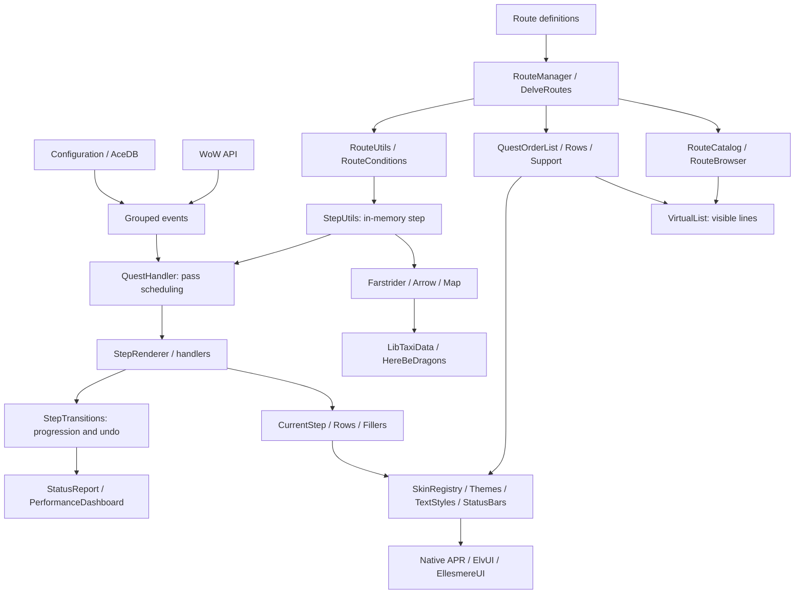

# APR-Core: architecture and audit

Audit dated 8 October 2026. Scope: core Lua modules, localization entries,
loaded media, and dependencies. The definitions in
`Routes/` are used to verify consumers; only the author and community metadata for
the EclipseGlaives route were added at the maintainer's request. Changes outside
the core concern the manifest, tests, and validation references required for
travel.

Maintenance principle: **readability, readability, readability**. A helper is
shared when it expresses the same contract for multiple consumers. Window
controllers, subscriptions, and business state remain in their own domain.
Comments explain constraints and side effects; they do not repeat accessor names.

## Loading and data flow

[`APR.toc`](../APR.toc) defines the load order. The folders describe the
responsibilities, not the order itself: a function may reference a module loaded
later as long as it is not called until after initialization.

1. Libraries, Farstrider data selected by client, and AceLocale.
2. `SecretUtils`, creation of the AceAddon `APR` object, skin registry, and taxi adapter.
3. Helpers, visual foundations, route engine, and models.
4. Configuration, events, features, windows, and visual integrations.
5. Registration of client routes, then the AceAddon `OnInitialize` call.
6. Identity, AceDB, and save data, followed by window initialization and subscriptions.



`GetRouteSteps` builds the effective list: scenarios, parallel groups, and
temporary routes. `GetStep` returns a shallow copy for navigation adjustments.
`GetCurrentStep` resolves the saved progression and shares this copy with the arrow
and events. **Nested tables in a definition remain read-only.**

## File map

### Initialization and configuration

| File                                                               | Responsibility                                                               |
| ------------------------------------------------------------------ | ---------------------------------------------------------------------------- |
| [core/Core.lua](core/Core.lua)                                     | AceAddon object, identity, saves, and module initialization.                 |
| [core/Event.lua](core/Event.lua)                                   | Events, notification grouping, and deferred callbacks.                       |
| [core/Commands.lua](core/Commands.lua)                             | Routing of `/apr` commands to their modules.                                 |
| [core/Performance.lua](core/Performance.lua)                       | Voluntary capture: aggregates, histograms, slow calls, and bounded counters. |
| [core/VersionCheck.lua](core/VersionCheck.lua)                     | Client/addon versions and group announcements without web requests.          |
| [core/ErrorLog.lua](core/ErrorLog.lua)                             | Session-only APR error references, deduplication, native handler chaining and BugGrabber integration; bounded to 100 entries. |
| [config/Config.lua](config/Config.lua)                             | AceDB defaults, AceConfig options, profiles, and minimap button.             |
| [config/WorkspaceOptions.lua](config/WorkspaceOptions.lua)         | Settings categories and task-specific subpages; retains authoritative callbacks and constraints. |
| [config/AboutData.lua](config/AboutData.lua)                       | Verified credits and live counts/authors from loaded route definitions; never builds effective steps. |
| [config/Config_Route.lua](config/Config_Route.lua)                 | Route/catalog notifications and AceConfig entry to the single library.       |
| [config/Config_Route_Prefabs.lua](config/Config_Route_Prefabs.lua) | Predefined routes built from metadata and conditions.                        |
| [config/LevelProfiles.lua](config/LevelProfiles.lua)               | XP bonus data and threshold profiles; no rendering.                          |

### Models

| File                                                                 | Responsibility                                              |
| -------------------------------------------------------------------- | ----------------------------------------------------------- |
| [data/models/Classes.lua](data/models/Classes.lua)                   | Class/specialization IDs and locale-independent route keys. |
| [data/models/Enums.lua](data/models/Enums.lua)                       | Shared clients, categories, expansions, and orders.         |
| [data/models/Quest.lua](data/models/Quest.lua)                       | Priority of primary actions and quest/dialogue rules.       |
| [data/models/Spells.lua](data/models/Spells.lua)                     | Hearthstone item/spell matches, toys, and buffs.            |
| [data/zones/ScenarioEntrances.lua](data/zones/ScenarioEntrances.lua) | Scenario entries for external guidance.                     |

### Features and route engine

| File                                                                                                 | Responsibility and contract                                                                       |
| ---------------------------------------------------------------------------------------------------- | ------------------------------------------------------------------------------------------------- |
| [features/questing/RouteManager.lua](features/questing/RouteManager.lua)                             | Compatibility, prerequisites, and cache of effective steps; distinct visibility for availability. |
| [features/questing/DelveRoutes.lua](features/questing/DelveRoutes.lua)                               | Delves, scenarios, and insertion/restoration of temporary routes.                                 |
| [features/questing/RouteSuggestions.lua](features/questing/RouteSuggestions.lua)                     | Index of the first quests that trigger a route suggestion.                                        |
| [features/questing/QuestHandler.lua](features/questing/QuestHandler.lua)                             | Batch scheduling, render transaction, and rejection of stale callbacks.                           |
| [features/questing/QuestCache.lua](features/questing/QuestCache.lua)                                 | Journal synchronization and quest event handling.                                                 |
| [features/questing/StepRenderer.lua](features/questing/StepRenderer.lua)                             | Pass orchestration, with priority for existing actions.                                           |
| [features/questing/StepInstructions.lua](features/questing/StepInstructions.lua)                     | Additional instructions, buttons, and group quest selection.                                      |
| [features/questing/StepQuestHandlers.lua](features/questing/StepQuestHandlers.lua)                   | Acceptance, objectives, abandonment, and turn-in.                                                 |
| [features/questing/StepTravelHandlers.lua](features/questing/StepTravelHandlers.lua)                 | Hearth, portals, waypoints, taxi, and scenarios.                                                  |
| [features/questing/StepActionHandlers.lua](features/questing/StepActionHandlers.lua)                 | Money, items/spells, treasure, groups, and achievements.                                          |
| [features/questing/StepTransitions.lua](features/questing/StepTransitions.lua)                       | Progress writing, revised context, history, and the last undoable jump.                           |
| [features/questing/RouteCatalog.lua](features/questing/RouteCatalog.lua)                             | Search, provenance, availability, favorites, and route mutations with prerequisites.              |
| [features/questing/RouteActions.lua](features/questing/RouteActions.lua)                             | Inventory, bank, repair, training, death, and taming; context verification before action.         |
| [features/questing/Gossip.lua](features/questing/Gossip.lua)                                         | Automatic dialogues, NPC rules, and delays.                                                       |
| [features/navigation/Arrow.lua](features/navigation/Arrow.lua)                                       | Orientation, distance, visibility, and arrival at a configurable cadence.                         |
| [features/navigation/FlightPath.lua](features/navigation/FlightPath.lua)                             | Taxi discoveries and route-requested flight selection.                                            |
| [features/navigation/Map.lua](features/navigation/Map.lua)                                           | Map and minimap markers and lines using HereBeDragons.                                            |
| [features/navigation/WorldCoordinateConverter.lua](features/navigation/WorldCoordinateConverter.lua) | Author conversion/export on detached copy; geometry of collection zones.                          |
| [features/player/AFK.lua](features/player/AFK.lua)                                                   | Countdown and anchor; no `OnUpdate` once stopped.                                                 |
| [features/player/Buff.lua](features/player/Buff.lua)                                                 | Route buffs via AuraContainer or per-request checks depending on capabilities.                    |
| [features/player/Heirloom.lua](features/player/Heirloom.lua)                                         | Heirloom/enchantment reminders and reused secure buttons.                                         |
| [features/player/XPBuffOverlay.lua](features/player/XPBuffOverlay.lua)                               | Applicable XP reminders, secure actions, and persistent hiding.                                   |
| [features/player/Cutscenes.lua](features/player/Cutscenes.lua)                                       | Movies/cinematics; modifiers, settings, and `Dontskipvid`.                                        |
| [features/group/Party.lua](features/group/Party.lua)                                                 | Group progression, rate-limited sending, and incoming fragments.                                  |
| [features/group/PartyProtocol.lua](features/group/PartyProtocol.lua)                                 | Validation/copy of consumed fields, real sender, and bounded cost.                                |

### Integrations

| File                                                                         | External boundary                                                               |
| ---------------------------------------------------------------------------- | ------------------------------------------------------------------------------- |
| [integrations/TaxiData.lua](integrations/TaxiData.lua)                       | `LibTaxiData_API` facade, capability control, and login diagnostics.            |
| [integrations/Farstrider.lua](integrations/Farstrider.lua)                   | Graph to instructions/arrow, path cache, and compatibility predicates.          |
| [integrations/ForeverTravel.lua](integrations/ForeverTravel.lua)             | Flight links observed on Forever, tied to the character.                        |
| [integrations/SkinRegistry.lua](integrations/SkinRegistry.lua)               | Low-level APR control registry, single provider, and out-of-combat application. |
| [integrations/ElvUISkin.lua](integrations/ElvUISkin.lua)                     | ElvUI appearance and anchored panel backgrounds.                                |
| [integrations/EllesmereUISkin.lua](integrations/EllesmereUISkin.lua)         | Public EUI API, updated theme fonts and colors.                                 |
| [integrations/EllesmereUISettings.lua](integrations/EllesmereUISettings.lua) | Private AceGUI pool: the APR skin does not propagate to other addons.           |

### Interface

| File                                                                         | Responsibility and contract                                                       |
| ---------------------------------------------------------------------------- | --------------------------------------------------------------------------------- |
| [ui/foundations/TextStyles.lua](ui/foundations/TextStyles.lua)               | Style inheritance, semantic colors, and low-level text/tooltip registry.          |
| [ui/foundations/StatusBars.lua](ui/foundations/StatusBars.lua)               | Native bars; APR owns the colors, skins provide the texture.                      |
| [ui/foundations/Themes.lua](ui/foundations/Themes.lua)                       | WoW surfaces and live skin colors for custom icons, highlights and selections.    |
| [ui/foundations/Widgets.lua](ui/foundations/Widgets.lua)                     | Persistent windows, buttons, search, menus, tooltips, and shared copyable text.   |
| [ui/foundations/SettingsWidgets.lua](ui/foundations/SettingsWidgets.lua)     | Embedded AceConfig host and isolated WoW/ElvUI controls; delegates the EllesmereUI appearance to its integration. |
| [ui/foundations/SettingsRows.lua](ui/foundations/SettingsRows.lua)           | Form rows with wrapping labels/descriptions and aligned controls; preserves AceGUI values and callbacks. |
| [ui/foundations/VirtualList.lua](ui/foundations/VirtualList.lua)             | Height indexing and recycling of only visible lines.                              |
| [ui/foundations/SelectionDialog.lua](ui/foundations/SelectionDialog.lua)     | Skinnable choices and confirmations, bounded scrolling and shared cancellation.   |
| [ui/route/CurrentStep.lua](ui/route/CurrentStep.lua)                         | Window, bars, secure buttons, and delayed changes after combat.                   |
| [ui/route/CurrentStepRows.lua](ui/route/CurrentStepRows.lua)                 | Transactions, matching by key, recycling, and line layout.                        |
| [ui/route/CurrentStepImagePreview.lua](ui/route/CurrentStepImagePreview.lua) | Thumbnails and reusable windows; zoom, movement, and real ratio.                  |
| [ui/route/FillersFrame.lua](ui/route/FillersFrame.lua)                       | Optional objectives, content transactions, and panel anchoring.                   |
| [ui/route/QuestOrderList.lua](ui/route/QuestOrderList.lua)                   | Batch-built templates, atomic publication, and only visible lines instantiated.   |
| [ui/route/QuestOrderListRows.lua](ui/route/QuestOrderListRows.lua)           | Presentation of future actions without executing business logic.                  |
| [ui/route/QuestOrderListSupport.lua](ui/route/QuestOrderListSupport.lua)     | Shared template measurement, reusable rows, coroutine, reputation, and scrolling. |
| [ui/route/QuestionPopUp.lua](ui/route/QuestionPopUp.lua)                     | Confirmations, text inputs, and selections with refreshed callbacks.              |
| [ui/route/RouteSelection.lua](ui/route/RouteSelection.lua)                   | Invitation to choose a route when the path is unusable.                           |
| [ui/route/RouteBrowser.lua](ui/route/RouteBrowser.lua)                       | Prefabs first, expansions/community, filters, favorites and ordered path.         |
| [ui/route/RouteBrowserRows.lua](ui/route/RouteBrowserRows.lua) | Compact catalog/path rows, metadata tooltips and recycled actions. |
| [ui/panels/Coordinates.lua](ui/panels/Coordinates.lua)                       | Coordinates for authors and saved window position.                                |
| [ui/panels/Workspace.lua](ui/panels/Workspace.lua)                           | Shared lazy window, top-level navigation and optional Perf tab; owns geometry and Escape handling. |
| [ui/panels/OptionsPanel.lua](ui/panels/OptionsPanel.lua)                     | Scrollable settings, category navigation and remembered subpages backed by AceConfig. |
| [ui/panels/ReleaseNotesPanel.lua](ui/panels/ReleaseNotesPanel.lua)           | Release preferences, selectable GitHub URL and independently scrolling Markdown notes. |
| [ui/panels/AboutPanel.lua](ui/panels/AboutPanel.lua)                         | Top links, installation facts, help, live command reference and contributors in reusable text rows. |
| [ui/panels/ChangeLog.lua](ui/panels/ChangeLog.lua)                           | Formats version notes and opens the same Options category at startup or on request. |
| [ui/panels/LayoutEditor.lua](ui/panels/LayoutEditor.lua)                     | Independent outlines; cancel without mutation, save LibWindow out of combat.      |
| [ui/panels/StatusReport.lua](ui/panels/StatusReport.lua)                       | Complete status overview, bounded error table, shared identity masking and independent formatted exports. |
| [ui/panels/PerformanceDashboard.lua](ui/panels/PerformanceDashboard.lua)     | Peak graph, compact sortable call table, slow calls, counters, and export. |
| [ui/panels/PerformanceResources.lua](ui/panels/PerformanceResources.lua)     | CPU/memory graphs, time-window controls and retained-data summaries. |

### Shared utilities

| File                                                           | Shared contract                                                                        |
| -------------------------------------------------------------- | -------------------------------------------------------------------------------------- |
| [utils/Utils.lua](utils/Utils.lua)                             | Tables/strings, deep copy, diagnostics, compatible events, and outbound fragmentation. |
| [utils/SecretUtils.lua](utils/SecretUtils.lua)                 | Access to values/tables and safe identity; loaded before APR.                          |
| [utils/PlayerUtils.lua](utils/PlayerUtils.lua)                 | Client, abilities, spells, resources, reputation, and action availability.             |
| [utils/ProfileUtils.lua](utils/ProfileUtils.lua)               | Character-scoped AceDB and profile-overriding preferences.                             |
| [utils/TextStyleUtils.lua](utils/TextStyleUtils.lua)           | AceConfig style controls; rendered in `TextStyles`.                                    |
| [utils/UIUtils.lua](utils/UIUtils.lua)                         | Frames, movement, anchoring, tooltips, images, and asset validation.                   |
| [utils/TargetUtils.lua](utils/TargetUtils.lua)                 | Public NPC identity, emotes, and raid marker macro.                                    |
| [utils/QuestUtils.lua](utils/QuestUtils.lua)                   | Asynchronous titles, acceptance pool, objectives, and completion.                      |
| [utils/StepUtils.lua](utils/StepUtils.lua)                     | Current step, progression, text, coordinates, and zones.                               |
| [utils/RouteUtils.lua](utils/RouteUtils.lua)                   | Filters, XP thresholds, imports, saved signatures, and keys/labels.                    |
| [utils/RouteConditions.lua](utils/RouteConditions.lua)         | Embedded skills and conditions for execution/preview.                                  |
| [utils/RouteHashUtils.lua](utils/RouteHashUtils.lua)           | Deterministic definition fingerprint, non-cryptographic.                               |
| [utils/SojournerUtils.lua](utils/SojournerUtils.lua)           | Campaign jump, character recall, and group consistency.                                |
| [utils/InstanceUtils.lua](utils/InstanceUtils.lua)             | Instance visibility and character initial preference.                                  |
| [utils/NavigationUtils.lua](utils/NavigationUtils.lua)         | Player body and normalized taxi discoveries.                                           |
| [utils/PlayerPositionUtils.lua](utils/PlayerPositionUtils.lua) | Position and axis order at the WoW/APR boundary.                                       |
| [utils/ZoneDetectionUtils.lua](utils/ZoneDetectionUtils.lua)   | Map cache, parent/child relationships, and player zone.                                |
| [utils/BuyMerchantUtils.lua](utils/BuyMerchantUtils.lua)       | Purchased quantities and localized loot messages.                                      |
| [utils/LootUtils.lua](utils/LootUtils.lua)                     | Collections, remembered bank, and sale value without selling.                          |

## Dependencies, media, and entry points

| Dependency                          | Usage                                                                           |
| ----------------------------------- | ------------------------------------------------------------------------------- |
| LibStub / CallbackHandler           | Internal Ace3/HBD libraries and callbacks.                                      |
| AceAddon / AceEvent                 | Modules, lifecycle, and route/catalog messages.                                 |
| AceDB / AceDBOptions                | Profiles and character scope; live object `APR.settings.db`.                    |
| AceConfig / Registry / Dialog / Cmd | Options; sub-libraries loaded via AceConfig XML.                                |
| AceGUI                              | Options and converter; recycling and private pool for EUI.                      |
| AceConsole                          | Registration of `/apr`.                                                         |
| AceLocale                           | 11 locales, English by default; strings injected at packaging time.             |
| AceSerializer                       | Serialization of progression for the group.                                     |
| HereBeDragons / Pins                | Coordinates and map/minimap markers.                                            |
| FarstriderLib / Data                | Graph and data; manifest `Standard` or `Camelot`, then finalization.            |
| LibTaxiData                         | External dependency required by `.pkgmeta`, optional in the TOC for load order. |
| LibDataBroker / LibDBIcon           | Minimap launcher.                                                               |
| LibSharedMedia                      | Font resolution.                                                                |
| LibWindow                           | Window positions and scales.                                                    |
| ElvUI / EllesmereUI                 | Optional; absence of both keeps native rendering.                               |

AceComm, AceBucket, AceHook, AceTab, and AceTimer are no longer loaded by
`embeds.xml`: no executed consumer was found in APR or the embedded libraries.
Their provider sources remain intact in `libs/` but are excluded from releases
by `.pkgmeta`, along with the unused HereBeDragons migration module. The provider
libraries are not renamed or annotated as APR code.

The eight media assets in `assets/` cover the logo, header, arrow, minimap icon,
the `/apr 42` sound, and three `routeHelper/` illustrations. The illustration
names may come from routes/recorder data: the absence of a direct call in the core
does not prove a media asset is unused.

External inputs: `/apr`, XML bindings, AceAddon/AceDB callbacks, WoW events,
group messages, and route imports. `RegisterCustomRoute`, legacy flat lists, and
`AprRCData.ExtraLineTexts` remain supported. Option and SavedVariable names are kept.

| Access                                   | Common usage                                                      |
| ---------------------------------------- | ----------------------------------------------------------------- |
| `/apr`                                   | Options in the shared APR workspace; Blizzard settings contain only a launcher. |
| `/apr route`                             | Predefined paths, expansion/community browsing, filters and favorites. |
| `/apr status` or `?` button on the guide | Compact status and copyable Lua report including current-step data.           |
| `/apr rollback` / `/apr rb`               | Undo the last valid manual skip, otherwise return to the previous visible step. |
| `/apr perf`                              | Open the dashboard; start/stop, sort, search, and export.         |
| `/apr perf on` / `/apr perf off`         | Control capture without opening the dashboard.                    |
| `/apr layout` or placement in settings             | Move previews, cancel, save or bring them back on screen.                       |

Settings retain their existing AceConfig categories. The route selector opens
separately from `/apr route` and the existing route entry points. Performance
remains available through its slash command.

## Saves and caches

| State                                                | Owner and lifetime                                                                         |
| ---------------------------------------------------- | ------------------------------------------------------------------------------------------ |
| `APRSettings`                                        | AceDB: visual/automation profiles and character preferences.                               |
| `APRData`                                            | Progression by `PlayerID`, imports, NPCs, temporary/parallel state, bank, and performance. |
| `APRCustomPath` / `APRZoneCompleted`                 | Ordered path and completed routes per character.                                           |
| `APRTaxiNodes` / `APRTaxiNodesTimer`                 | Discoveries and trip measurements; legacy names normalized to booleans.                    |
| `APRScenarioCompleted` / `APRScenarioMapIDCompleted` | Scenario progression per character.                                                        |
| `APRItemLooted` / `APRGossipValidated`               | Historical state of items/dialogues; keys preserved for existing progression paths.        |
| `FarstriderLibData_CharacterSettings`                | Character save data for the movement library.                                              |
| Memory caches                                        | Steps, titles, XP, maps, paths, widgets, and skins; invalidation by owner.                 |

Deep import copy (`DeepCopyTable`) isolates saves. Shallow runtime copy (`GetStep`)
shares navigation adjustments. Modifying a route signature can invalidate existing
progression: this is not a simple local optimization.

## Cleanups and fixes applied

- Six controllers moved out of `utils`: coordinates, cinematics, suggestions,
  route engine, delves, and list support.
- Shared deep copy with cycles and shared references for converter, imports, and
  profiles; step lookup, bounds, list comparison, and spell name handling shared.
- Assets moved into `UIUtils`, step text into `StepUtils`, and item/spell capability
  logic into `PlayerUtils`. Literal text search without a pattern and hexadecimal validation.
- Removal of helpers without an identified consumer, currency tracking without a
  reader, unexposed group simulations, and inaccessible image hooks. Methods called
  indirectly by AceAddon are preserved.
- Renames: `HasRouteInCustomPath`, `UpdateQpartPartWithQuestText`,
  `HandleMessageFragment`, `UpdatePosition`, `RegisterEvents`, `TableToDebugString`,
  and `questOrderListSupport`.
- End of generic globals `SettingsDB`, `LoadedProfileKey`, and `UpdateGroupStep`:
  state is attached to its module or local scope.
- Timers canceled via their handle; callback errors passed to the WoW handler.
- Reputation signatures also traverse `AllOf` and `Not` to invalidate stale lists.
- Fragments isolated by sender, index/size validated, duplicates ignored,
  expiration cleaned on assembly, and unnecessary ticker stopping.
- `Dontskipvid` protects films and cinematics; delayed skips re-check preferences.
- EUI settings icon independent of DamageMeters; ElvUI images handled by the common registry.

## Rework contracts

### Progression and diagnostics

`QuestHandler` orchestrates passes; quest, travel, and action handlers remain
separate. `StepTransitions` centralizes progression and provides a
character/route/index/revision context. Deferred callbacks verify this context
before acting. History retains at most 40 transitions.

Undo covers a single manual jump and the steps automatically traversed while it is
being resolved. Later progression or a route change invalidates it. It restores
the guide index, then the engine re-evaluates conditions; it does not restore the
state of in-game quests.

`StatusReport` retains the compact client, character and route sections. Its Lua
export includes `currentStepData` from `PeekCurrentStep` and uses the bounded,
indented formatter. The identity toggle applies to both the window and export;
free-form route text is not anonymized. Wait-reason explanations are not included.

### Group messages

Validation after deserialization copies only the fields consumed by the interface,
removes presentation markup, checks finite numbers, and attaches identity to the
true sender. Table traversal is bounded to 128 entries. Assembly accepts up to
128 fragments of 180 bytes, two pending messages per sender, and 80 in total.
Rejected data feeds the diagnostic; it does not spam chat.

The `PartyValidate` measurement allows verifying the actual in-game cost. Offline
tests cover malformed input and limits without claiming to prove the absence of
client-side lag.

### Library and authors

The catalog separates route consultation, availability, and modification.
Three prefab actions sit above expansion navigation, a compact route table and
an always-visible custom path. Community has its own navigation entry; type and
favorites are combinable filters. Search also matches authors across expansions
and returns to the selected expansion when cleared. Catalog and path rows are
26 pixels high; narrow windows move author/progress detail into tooltips.
Selecting or filtering never starts a route. Right-click adds/resumes; Shift-right-click
resets and adds. The + action, prerequisite insertion and path reorder/remove
controls use the existing route engine.
A route removed from the catalog but still saved in a route remains visible in that
route so it can be deleted.

Attribution requested by the maintainer: **APR by default**; the route
`84-EclipseGlaives-10-to-70` is credited to **EclipseGlaives** and promoted in the
Community. This information is stored in the route data, without a catalog-only
exception. The `author` field is optional and defaults to APR; `authors` allows
multiple co-authors when `author` is absent. `community = true` or
`source = "community"` identifies a community route. `description` provides the
optional tooltip text. The validation schema knows these fields; authors are never
inferred from Git.

### Lists and measurements

`VirtualList` keeps models and their heights, then instantiates only the viewport
lines with a scrolling margin. The step list uses a hidden measurement line with
the same rendering as the visible lines; it prepares models in batches of 3 ms
and publishes them all at once. `stepList` and `rawStepContainers` now contain
models; their `frame` property is defined only when a line is displayed. Filters,
route changes, and resize events invalidate stale work.

Performance capture is inactive by default and after reload. It keeps up to 64
unique names plus `Other` per family, 100 calls of at least 10 ms, and 120 seconds
of graph history. Histograms use bins of < 1, 1–3, 3–10, and ≥ 10 ms. The
dashboard exposes aggregates, slow calls, and cache counters; its refresh stops
when closed. Closing the dashboard leaves voluntary capture active. Data is saved
in `APRData.PerformanceLog`.

Durations are inclusive: nested calls overlap and their sum is not the addon's total
CPU usage. The instrumented tables show registered call sites. Separate CPU and memory
graphs use the resource monitor; they do not attribute allocations to individual
functions or prove a memory leak.

CPU/FPS samples run once per second without scanning memory. The resource page's
Measure memory button explicitly refreshes the memory reading; its original timestamp
is retained on subsequent CPU samples. The scan can briefly block the client, and its
cost is recorded as `ResourceMemoryScan`. Closing or resetting capture never starts a scan.
`StepRenderContent` and `StepRenderCommit` distinguish step logic from row/layout commits;
`RoutePathUiRefresh` measures the catalog/status refresh coalesced outside step rendering.

At rest, the arrow keeps lightweight position/facing checks and resolves route/map data
only when its inputs change or its one-second safety interval expires. Unchanged color,
heading cell and distance text are not rewritten. Tracker observers reuse geometry probes
every 200 ms; complete layout and appearance safety checks run at most once a second when
idle. Content changes invalidate the probe through the shared snapping revision. Movement,
step changes and changed tracker geometry still update at their normal cadence. The same
probe serves the CurrentStep fallback; it stays dormant when the main observer exists.
`ArrowPositionUpdate`, `TrackerGeometryProbe`, `TrackerLayoutUpdate` and
`TrackerAppearanceUpdate` identify this background work during voluntary capture.

## UI/UX and skins

- Workspace options open on Automation. Its General tab combines quest preferences and
  gameplay convenience in inline sections; waypoints, dialogue and rewards have their own tabs.
  Current step, secondary objectives, step list, arrow, map/minimap, AFK, group, heirloom and
  XP bonuses retain separate categories. Appearance contains theme selection, typography
  and the placement action. Profiles, Release notes and Debug complete the navigation;
  addon activation lives in Debug. Reset options stays fixed in every category header.
  The source AceConfig callbacks remain authoritative.
- WoW remains the only native theme; gameplay panels retain their configured colors.
- Arrow style is a profile preference: Classic remains the default, with an optional APR
  silver/enamel design. Both atlases use the same 108 heading cells, direction colors,
  distance and arrival logic. Rebuild the APR atlas with `python tools/render_arrow_style.py`;
  its original artwork and imagegen prompt are in `tools/artwork/Arrow-APR.*`.
  APR art uses a 1.8 size multiplier; Classic retains its original dimensions.
  Arrow geometry and text have independent size controls. `arrowTextScale` is initialized
  once from the old combined `arrowScale` to retain existing profiles' text size.
- Route browsing, placement and the performance dashboard reuse the shared controls.
  New windows record size and position in the profile. The placement editor manipulates
  independent outlines until Save; Cancel, Esc, or entering combat abandons the preview.
  First use opens this editor once per installation (`global.layoutEditorSeen`), after
  login and out of combat. Hidden snapped previews reserve content space and move as
  one group; saving retains attachments and uses top-left coordinates for free panels.
- Only one provider paints a control: ElvUI takes priority if both are active. Switching
  providers requires a reload.
- APR owns the secure buttons, attributes, and callbacks; the skin modifies the appearance.
  Protected changes wait until combat ends.
- Public EUI primitives and refreshed accents/fonts; bar colors remain consistent with APR options.
- `integrations/QuestTracker.lua` resolves Blizzard, Questie and Kaliel's containers.
  APR stays anchored to UIParent and never hooks Blizzard tracker layout callbacks. Below follows
  visible tracker content. Above keeps APR's top fixed and temporarily translates the
  tracker by the height of Current Step → AFK → Fillers → Quest Order List. Detaching,
  hiding APR, entering the owner's edit mode or switching providers restores original
  anchors unless their owner has changed them. Combat defers all translations.
  `currentStepTrackerSide` intentionally has no AceDB default: existing attached profiles
  migrate to `below`, other profiles start with `above`. Placement group offsets live in
  APR's profile, never in the tracker addon's saved settings.
  Blizzard's above adapter temporarily removes its default-position tracker from
  `RightManagedFrameContainer`, disables screen clamping, and fits its viewport below
  the complete APR stack (including headers and configured gaps). Native managed
  updates cannot reset that displacement. Detaching or entering Edit Mode restores
  management, parent, scale, anchors, height and clamping; customized Edit Mode anchors
  remain respected. The legacy below attachment stays read-only without a group offset.
  Kaliel's adapter resolves the instance from its MSA event-library embeddings: Kaliel
  deliberately removes itself from the AceAddon registry. It temporarily disables container
  clamping and reserves space for APR both above and below, with a four-point gap.
  Post-hooks on Kaliel's own size/move methods reapply the
  reservation after content or option changes. Detaching restores its native size,
  anchors, screen clamping and separate quest-item buttons without modifying its profile.
  Optional tracker appearance matching affects only the attached guide panels and can
  restore their APR styling; fonts, header textures, background and borders come from
  the loaded provider. Kaliel uses one continuous background behind the APR stack,
  distinct main/module headers, its own control artwork and the live font/color settings.
  Attached panel widths, rows, previews and progress bars follow the rendered tracker width;
  fonts and icons respect its scale. Opting out restores APR's independent dimensions.
  Adapter references: Questie's official tracker modules and the
  installed Kaliel's Tracker 8.7.2 container, background and separate item-button frame.
- Visible content, lines, and scrolling are preserved during refreshes. The list prepares its
  buffer in batches; a costly element may still exceed the budget of a single batch.

The specialized renderings for the step, future list, and group are retained: their information
and interactions differ. Merging them into one large configurable factory would reduce readability.

Design references consulted: [VaultLoom](https://www.curseforge.com/wow/addons/vaultloom),
[Waypoint UI](https://github.com/Adaptvx/Waypoint-UI),
[Narcissus](https://github.com/Peterodox/Narcissus), and
[Plumber](https://github.com/Peterodox/Plumber). The design keeps principles of
clear navigation, visual hierarchy, and contextual detail. No code or assets from these
addons are incorporated into the redesign.

## Validation and evolution

From the root:

```powershell
.venv\Scripts\python.exe tests\run.py
```

Regression coverage added: saves/copies, step lookup, AceDB isolation, timers,
errors, nested reputation, cinematics, and message assembly. Fixtures load the
moved helpers in the same relative order as the TOC; rendering, progression, and
recycling assertions are preserved. The redesign adds scenarios for transitions/undo,
party validation, catalog/authors, preset dispatch, placement transactions, status,
bounded capture, skins, and virtualization. Tests use the real module code with
simulated WoW APIs.

Workspace coverage includes the real AceGUI widget pool and checkbox callbacks,
option/constraint preservation, navigation state, missing realm globals, redacted
exports and live About metadata. These checks use simulated WoW APIs; they do not
certify the game renderer. Offline composition also exercises the real AceConfig
renderer at the window's minimum size.
The [manual UI test plan](../tools/validation/UI_MANUAL_TESTS.fr.md) covers placement,
predefined paths, route editing, filters, small windows, client compatibility and
skins. Run it manually in WoW; no client is started or controlled by the test runner.

The route window displays APR's logo directly in its header: the artwork already
includes a ring, so it needs no additional portrait frame. The complete 2000px
master in `tools/artwork/APR-logo.png` exports to a transparent 256px TGA; the
source is excluded from addon packages. The medallion covers the window corner,
while navigation tabs overlap behind the upper border.

Native utility frames use fixed-radius corners (8 for windows, 6 for bordered
panels, 4 for controls), with transparent corner fills and one-unit edge strokes.
The exporter generates the eight-strip edge atlas expected by Blizzard's
[Backdrop implementation](https://github.com/Gethe/wow-ui-source/blob/live/Interface/AddOns/Blizzard_SharedXML/Backdrop.lua).
External skins remove these native fills before applying their own appearance.
The controls use
[Material Design Icons](https://pictogrammers.com/library/mdi/) 7.4.47, as in the
Route Recorder. SVG sources, licenses and the icon manifest are in `assets/ui/mdi`.
Run `python tools/render_ui_icons.py` with Pillow and resvg-py to regenerate the
antialiased TGA textures offline. The client only loads the exported textures.

## Possible improvements after validation

| Priority | Proposed follow-up                                                           | Required validation                                                                                     |
| -------- | ---------------------------------------------------------------------------- | ------------------------------------------------------------------------------------------------------- |
| P1       | Fix discrepancies observed during manual UI validation.               | Reproduction with client, skin, resolution, and report; no visual certification outside the game.       |
| P2       | Split the option families in `Config.lua` and event families in `Event.lua`. | Explicit contracts for shared state and behavior regressions; preserve keys and SavedVariables.         |
| P2       | Localize the new labels beyond FR/EN.                                        | Proofreading via AceLocale `UI_*` keys and in-game length checks.                                       |
| P2       | Complete community entries: descriptions and multiple authors.               | Metadata supplied by maintainers/authors, recorder compatibility; no inferred attribution.              |
| P3       | Adjust build budgets and caches based on real captures.                      | Comparable measurements on the same routes/clients; do not optimize from simulated timings alone.       |
| P3       | Add more explanatory text for specialized actions.                           | Reliable public state and contracts verified per action type; diagnostics must remain side-effect free. |
| P3       | Explore complete keyboard navigation for the new lists.                      | Focus handling, Esc handling, and no keyboard capture after closure, verified in WoW.                   |

Route formats, save data, and signatures must remain compatible with the recorder.
Any future changes to `Routes/` content are a separate project from this APR-Core
audit.

## Appendix: WoW API references used in the core

Static inventory of 124 call references and availability checks for `C_*`
across 43 namespaces, excluding provider code. A reference does not mean the
function is available or called on both clients. Historical globals and widget
methods supplement these interfaces.

| Namespace                    | Referenced functions                                                                                                                                                                                                                                                                                                                                               |
| ---------------------------- | ------------------------------------------------------------------------------------------------------------------------------------------------------------------------------------------------------------------------------------------------------------------------------------------------------------------------------------------------------------------ |
| `C_AddOns`                   | `GetAddOnMetadata`                                                                                                                                                                                                                                                                                                                                                 |
| `C_AdventureMap`             | `Close`, `GetNumZoneChoices`, `StartQuest`                                                                                                                                                                                                                                                                                                                         |
| `C_BattleNet`                | `GetFriendAccountInfo`                                                                                                                                                                                                                                                                                                                                             |
| `C_CampaignInfo`             | `IsCampaignQuest`                                                                                                                                                                                                                                                                                                                                                  |
| `C_ChatInfo`                 | `PerformEmote`, `RegisterAddonMessagePrefix`, `SendAddonMessage`                                                                                                                                                                                                                                                                                                   |
| `C_ChromieTime`              | `GetChromieTimeExpansionOption`, `SelectChromieTimeOption`                                                                                                                                                                                                                                                                                                         |
| `C_ColorUtil`                | `WrapTextInColorCode`                                                                                                                                                                                                                                                                                                                                              |
| `C_Container`                | `GetContainerItemID`, `GetContainerItemInfo`, `GetContainerItemLink`, `GetContainerItemQuestInfo`, `GetContainerNumSlots`, `GetItemCooldown`, `UseContainerItem`                                                                                                                                                                                                   |
| `C_CreatureInfo`             | `GetCreatureID`                                                                                                                                                                                                                                                                                                                                                    |
| `C_CurrencyInfo`             | `GetCoinTextureString`                                                                                                                                                                                                                                                                                                                                             |
| `C_DateAndTime`              | `GetCurrentCalendarTime`                                                                                                                                                                                                                                                                                                                                           |
| `C_DeathInfo`                | `GetCorpseMapPosition`                                                                                                                                                                                                                                                                                                                                             |
| `C_EventUtils`               | `IsEventValid`                                                                                                                                                                                                                                                                                                                                                     |
| `C_FriendList`               | `GetFriendInfoByIndex`, `GetNumFriends`                                                                                                                                                                                                                                                                                                                            |
| `C_GameRules`                | `IsHardcoreActive`                                                                                                                                                                                                                                                                                                                                                 |
| `C_GossipInfo`               | `CloseGossip`, `GetActiveQuests`, `GetAvailableQuests`, `GetFriendshipReputation`, `GetFriendshipReputationRanks`, `GetNumActiveQuests`, `GetNumAvailableQuests`, `GetOptions`, `SelectActiveQuest`, `SelectAvailableQuest`, `SelectOption`, `SelectOptionByIndex`                                                                                                 |
| `C_Item`                     | `DoesItemExist`, `DoesItemMatchSpellItemCondition`, `GetDetailedItemLevelInfo`, `GetItemCooldown`, `GetItemCount`, `GetItemID`, `GetItemIconByID`, `GetItemInfo`, `GetItemInfoInstant`, `GetItemSpell`, `GetItemStats`, `IsUsableItem`                                                                                                                             |
| `C_MajorFactions`            | `GetCurrentRenownLevel`, `GetMajorFactionData`                                                                                                                                                                                                                                                                                                                     |
| `C_Map`                      | `GetBestMapForUnit`, `GetMapChildrenInfo`, `GetMapInfo`, `GetMapPosFromWorldPos`, `GetPlayerMapPosition`, `GetWorldPosFromMapPos`                                                                                                                                                                                                                                  |
| `C_Minimap`                  | `GetViewRadius`                                                                                                                                                                                                                                                                                                                                                    |
| `C_NamePlate`                | `GetNamePlates`                                                                                                                                                                                                                                                                                                                                                    |
| `C_PetBattles`               | `IsInBattle`                                                                                                                                                                                                                                                                                                                                                       |
| `C_PlayerChoice`             | `GetCurrentPlayerChoiceInfo`, `SendPlayerChoiceResponse`                                                                                                                                                                                                                                                                                                           |
| `C_PlayerInteractionManager` | `ConfirmationInteraction`                                                                                                                                                                                                                                                                                                                                          |
| `C_PvP`                      | `CanToggleWarMode`, `CanToggleWarModeInArea`, `IsWarModeActive`, `IsWarModeDesired`                                                                                                                                                                                                                                                                                |
| `C_QuestLine`                | `GetQuestLineInfo`                                                                                                                                                                                                                                                                                                                                                 |
| `C_QuestLog`                 | `AbandonQuest`, `AddQuestWatch`, `GetInfo`, `GetLogIndexForQuestID`, `GetMapForQuestPOIs`, `GetNumQuestLogEntries`, `GetNumQuestObjectives`, `GetQuestObjectives`, `GetTitleForQuestID`, `IsComplete`, `IsOnQuest`, `IsPushableQuest`, `IsQuestFlaggedCompleted`, `IsQuestFlaggedCompletedOnAccount`, `ReadyForTurnIn`, `RequestLoadQuestByID`, `SetSelectedQuest` |
| `C_Reputation`               | `GetFactionDataByID`                                                                                                                                                                                                                                                                                                                                               |
| `C_ScenarioInfo`             | `GetCriteriaInfoByStep`, `GetInfo`, `GetScenarioInfo`, `GetScenarioStepInfo`                                                                                                                                                                                                                                                                                       |
| `C_SkillInfo`                | `GetNumSkillLines`, `GetSkillLineInfo`, `GetSkillLineInfoByID`                                                                                                                                                                                                                                                                                                     |
| `C_SpecializationInfo`       | `GetSpecialization`, `GetSpecializationInfo`                                                                                                                                                                                                                                                                                                                       |
| `C_Spell`                    | `GetSpellCooldown`, `GetSpellCooldownDuration`, `GetSpellDescriptionForItemLocation`, `GetSpellInfo`, `GetSpellSubtext`, `GetSpellTexture`, `IsSpellUsable`, `TargetSpellChecksItemCondition`                                                                                                                                                                      |
| `C_SpellBook`                | `IsSpellInSpellBook`, `IsSpellKnown`                                                                                                                                                                                                                                                                                                                               |
| `C_StringUtil`               | `RemoveContiguousSpaces`, `StripHyperlinks`, `Trim`, `trim`                                                                                                                                                                                                                                                                                                        |
| `C_SuperTrack`               | `SetSuperTrackedQuestID`                                                                                                                                                                                                                                                                                                                                           |
| `C_TaskQuest`                | `GetQuestZoneID`                                                                                                                                                                                                                                                                                                                                                   |
| `C_TaxiMap`                  | `GetAllTaxiNodes`                                                                                                                                                                                                                                                                                                                                                  |
| `C_Timer`                    | `After`, `NewTicker`, `NewTimer`                                                                                                                                                                                                                                                                                                                                   |
| `C_ToyBox`                   | `GetToyInfo`, `IsToyUsable`                                                                                                                                                                                                                                                                                                                                        |
| `C_TransmogCollection`       | `GetItemInfo`, `PlayerHasTransmog`                                                                                                                                                                                                                                                                                                                                 |
| `C_UI`                       | `Reload`                                                                                                                                                                                                                                                                                                                                                           |
| `C_UIFileAsset`              | `IsKnownFile`                                                                                                                                                                                                                                                                                                                                                      |
| `C_UnitAuras`                | `GetPlayerAuraBySpellID`                                                                                                                                                                                                                                                                                                                                           |

Templates used: `ActionButtonTemplate`, `BackdropTemplate`, `CooldownFrameTemplate`, `CustomAuraContainerTemplate`, `InputBoxTemplate`, `ObjectiveTrackerContainerHeaderTemplate`, `ObjectiveTrackerModuleHeaderTemplate`, `SecureActionButtonTemplate`, `StaticPopupButtonTemplate`, `UIPanelButtonTemplate`, `UIPanelScrollFrameTemplate`.
