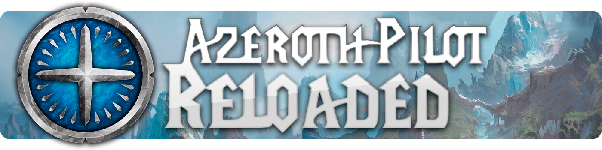
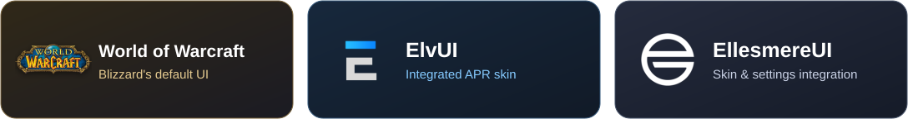

  

<h1 align="center">Your adventure. A clear path.</h1>

  A quest routing and leveling addon for <strong>World of Warcraft</strong>. 
  Follow the arrow, complete each objective, and shape the journey around your character. 
  The continuation, optimization, and rewrite of <strong>Azeroth Auto Pilot</strong>.

  
  
  

  
  
  

  <a href="#getting-started"><strong>Get started</strong></a> &nbsp;·&nbsp;
  <a href="#features"><strong>Features</strong></a> &nbsp;·&nbsp;
  <a href="#routes-and-compatibility"><strong>Routes</strong></a> &nbsp;·&nbsp;
  <a href="#interface-compatibility"><strong>Interfaces</strong></a> &nbsp;·&nbsp;
  <a href="#settings-and-commands"><strong>Commands</strong></a> &nbsp;·&nbsp;
  <a href="#wiki-and-support"><strong>Wiki &amp; support</strong></a> &nbsp;·&nbsp;
  <a href="#credits"><strong>Credits</strong></a>

---

## Getting started

<table>
  <tr>
    <td width="50%" valign="top">
      <h3>01 &nbsp; Install APR</h3>
      
Get the release for your game client from <a href="https://www.curseforge.com/wow/addons/azeroth-pilot-reloaded">CurseForge</a>. Install <strong>LibTaxiData</strong>, the required package dependency, too.

      
Installing manually? Extract the addon as <code>Interface/AddOns/APR</code>, then enable it on the character selection screen.

    </td>
    <td width="50%" valign="top">
      <h3>02 &nbsp; Choose your route</h3>
      
Type <code>/apr route</code>. Search compatible routes by expansion and category, select a route, or build an ordered custom path.

      
Use the <strong>Leveling</strong>, <strong>Speedrun</strong>, or <strong>All Quests</strong> presets to get started.

    </td>
  </tr>
  <tr>
    <td width="50%" valign="top">
      <h3>03 &nbsp; Make it yours</h3>
      
Type <code>/apr</code> to configure automation, rewards, map markers, text, and panels. Move and scale the interface to fit your layout.

      
Bind the <strong>APR item button</strong> in WoW's key binding settings for easy access to quest items.

    </td>
    <td width="50%" valign="top">
      <h3>04 &nbsp; Follow the adventure</h3>
      
Follow the waypoint arrow and current step. Check objective progress, extra instructions, and optional side objectives along the way.

      
Need to adjust your progress? Use <code>/apr skip</code>, <code>/apr rollback</code>, or <code>/apr reset</code>.

    </td>
  </tr>
</table>

> [!TIP]
> **Take control of an interaction.** Hold <kbd>Ctrl</kbd>, <kbd>Shift</kbd>, or <kbd>Alt</kbd> when interacting with an NPC, flight master, or merchant to bypass the corresponding interaction automation. These modifiers also bypass cutscene skipping. Item and spell buttons require your click or key press.

---

  

## Features

  <strong>Guided navigation &nbsp;·&nbsp; Quest automation &nbsp;·&nbsp; Flexible routes &nbsp;·&nbsp; A UI that fits you</strong>

<table>
  <tr>
    <td width="50%" valign="top">
      <h3>🧭 &nbsp; Navigation &amp; travel</h3>
      <ul>
        <li><strong>Waypoint arrow</strong> with distance and arrival-range checks; adjustable position, scale, and update frequency.</li>
        <li><strong>World map and minimap</strong> route lines and upcoming step markers, with configurable counts, sizes, colors, labels, and line thickness.</li>
        <li><strong>Travel between zones</strong>, flight-path discovery, automatic route-flight selection, and route-provided flight or wait countdowns.</li>
        <li><strong>Coordinate tools</strong>: world coordinate display and a map-to-world converter for route authors.</li>
      </ul>
    </td>
    <td width="50%" valign="top">
      <h3>⚡ &nbsp; Quest automation</h3>
      <ul>
        <li><strong>Accept route quests</strong> with configurable lookahead, plus an optional setting to accept other available quests.</li>
        <li><strong>Turn in quests</strong>, select route dialogue, and skip cutscenes and cinematics automatically.</li>
        <li><strong>Fine-tune dialogue</strong>: quest options, single-option behavior, Darkmoon travel fares, and red dialogue options have separate controls.</li>
        <li><strong>Skip waypoints</strong> optionally, with a separate setting for flying; skip completed campaign quests in supported Sojourner routes.</li>
      </ul>
    </td>
  </tr>
  <tr>
    <td width="50%" valign="top">
      <h3>🎒 &nbsp; Items, rewards &amp; merchants</h3>
      <ul>
        <li><strong>Quest item and spell buttons</strong>, target helpers, and a key binding for the APR item button.</li>
        <li><strong>Automatic reward selection</strong> with ordered priorities: item level, cosmetics, uncollected transmogs, and vendor price. Control multiple cosmetic or transmog choices separately.</li>
        <li><strong>Sell poor-quality items</strong> and repair equipment automatically when enabled; repairs use eligible guild funds before personal gold.</li>
        <li><strong>Route-directed actions</strong> for purchases, selected item sales, equipment, banking, training, and more, with progress tracking.</li>
      </ul>
    </td>
    <td width="50%" valign="top">
      <h3>🗺️ &nbsp; Routes &amp; progression</h3>
      <ul>
        <li><strong>Searchable, sortable route selection</strong>, expansion and category filters, presets, and an ordered custom path.</li>
        <li><strong>Character-aware steps</strong> using faction, race, class, specialization, level, quest progress, achievements, reputation, skills, items, and equipment conditions.</li>
        <li><strong>Route prerequisites and transitions</strong>, next-route suggestions, completion tracking, and skip, rollback, or reset controls.</li>
        <li><strong>Custom route support</strong> through the APR API or the separate APR Route Recorder addon.</li>
      </ul>
    </td>
  </tr>
  <tr>
    <td width="50%" valign="top">
      <h3>📋 &nbsp; Objectives &amp; instances</h3>
      <ul>
        <li><strong>Current step panel</strong> with live objective progress, extra instructions, target buttons, and route-provided image previews.</li>
        <li><strong>Quest Order List</strong> for previous, current, and upcoming steps; a separate filler panel for optional objectives and parallel tasks.</li>
        <li><strong>Scenarios and delves</strong> with instance objectives, supported scenario variants, and temporary guides that resume the parent route afterward.</li>
        <li><strong>Collection and progression goals</strong> for treasures, achievements, reputation, items, money, and level or XP thresholds.</li>
      </ul>
    </td>
    <td width="50%" valign="top">
      <h3>✨ &nbsp; XP &amp; leveling reminders</h3>
      <ul>
        <li><strong>Movable XP bonus overlay</strong> with individually selectable entries and remembered visibility preferences.</li>
        <li><strong>Level requirement profiles</strong> that adapt supported route thresholds to active XP bonuses, including the Midnight Delver's Call profile.</li>
        <li><strong>XP consumable reminders</strong> with optional usable-item buttons when a bonus is missing; bonuses count once their aura is active.</li>
        <li><strong>Heirloom, scouting-map, and route-specific buff reminders</strong> on supported clients and characters.</li>
      </ul>
    </td>
  </tr>
  <tr>
    <td width="50%" valign="top">
      <h3>🤝 &nbsp; Playing together</h3>
      <ul>
        <li><strong>Party progress panel</strong> showing route and step information shared by other APR users.</li>
        <li><strong>Automatic quest sharing</strong> with friends in your group when enabled.</li>
        <li><strong>Group quest prompts</strong> and scenario guidance where the selected route provides them.</li>
        <li><strong>Group display controls</strong> for received party data, panel visibility, scale, position, and text appearance.</li>
      </ul>
    </td>
    <td width="50%" valign="top">
      <h3>🎨 &nbsp; Interface &amp; integrations</h3>
      <ul>
        <li><strong>Flexible panels</strong>: move, lock, scale, or reset supported frames; snap the quest order, filler, and timer panels to the current step or attach it to the objective tracker.</li>
        <li><strong>Text and colors</strong>: shared or per-panel fonts, sizes, outlines, shadows, semantic colors, backgrounds, and progress bars.</li>
        <li><strong>Settings profiles</strong> with copy and reset controls, a minimap launcher, optional ElvUI and EllesmereUI skins, and EllesmereUI settings integration.</li>
        <li><strong>Localized interface and diagnostics</strong>: in-game changelog, update notifications, exportable status reports, zone debugging, event logging, and opt-in performance capture.</li>
      </ul>
    </td>
  </tr>
</table>

Use `/apr` to enable or disable APR, adjust these options, and configure automatic hiding of the route UI in party and raid instances. The current-step context menu also gives quick access to routes, profiles, panel locking, snapping, and item-button placement. Available behavior depends on your game client and the selected route.

### More ways a route can guide you

Beyond ordinary quest objectives, route authors can combine the following supported actions. The [Route Syntax wiki](https://github.com/Azeroth-Pilot-Reloaded/azeroth-pilot-reloaded/wiki/APR-Route-Syntax) documents the fields and conditions.

| Route activity         | What APR supports                                                                                                                                                        |
| ---------------------- | ------------------------------------------------------------------------------------------------------------------------------------------------------------------------ |
| Quest progression      | Pickups, hand-ins, alternative quest IDs, objective sub-steps, dropped quests, optional fillers, and abandoning specified quests.                                        |
| Travel and interaction | Waypoints, flight paths, Hearthstone binding and use, Dalaran and Garrison Hearthstones, Chromie Time, dialogue choices, emotes, vehicles, and glider instructions.      |
| Collections            | Treasure objectives, achievements and individual criteria, item quantities, and collection conditions.                                                                   |
| Character progression  | Level and XP targets, standard reputation, renown, friendship, professions, and skill training.                                                                          |
| Money and inventory    | Money collection with vendor-value estimates, merchant purchases and sales, equipping or destroying specified items, and Classic character-bank deposits or withdrawals. |
| Items and abilities    | Item-use and spell-cast steps, extra action buttons, NPC targeting and marking, and hunter beast-taming steps.                                                           |
| Special route steps    | Informational notes, War Mode prompts, optional group quests, scenario and instance entry or exit, and route completion or reset prompts.                                |
| Death skips            | Route-defined death and spirit-healer resurrection steps where appropriate; APR waits for death and does not kill the character.                                         |

## Routes and compatibility

| Route library                   | Available coverage                                                                                                                                    |
| ------------------------------- | ----------------------------------------------------------------------------------------------------------------------------------------------------- |
| **Retail · earlier expansions** | Vanilla, The Burning Crusade, Wrath of the Lich King, Cataclysm, Mists of Pandaria, Warlords of Draenor, Legion, Battle for Azeroth, and Shadowlands. |
| **Retail · recent expansions**  | Dragonflight, The War Within, and Midnight, plus Exile's Reach starting routes.                                                                       |
| **Midnight**                    | Leveling and campaign routes, speedruns, treasures, glyphs, and supported delve guidance.                                                             |
| **WoW Forever**                 | Dedicated starting-zone and leveling routes, selected for the compatible client and character.                                                        |
| **Custom**                      | Routes registered through the APR API or saved with APR Route Recorder.                                                                               |

Coverage varies by faction, character, and route. Retail expansion routes describe content played on the Retail client; compatibility with a separate Classic client depends on the release and route set. The route selector displays compatible routes for your client and character.

### Create your own adventure

Use **[APR Route Recorder](https://github.com/Azeroth-Pilot-Reloaded/APR-Route-Recorder)** to record gameplay, edit routes in its visual workshop or Lua editor, and make saved routes available in APR's **Custom** tab.

  

## Interface compatibility

APR works with Blizzard's default interface and includes optional skins for **ElvUI** and **EllesmereUI**.

  

Enable or disable each available skin in `/apr`. ElvUI and EllesmereUI are optional; install the one you use separately.

---

  

## Settings and commands

Type **`/apr`** to open settings or use APR's minimap launcher. All commands use the `/apr` prefix. Commands ignore case, trim surrounding whitespace, and collapse repeated spaces.

### Everyday controls

| Command        | Aliases  | What it does                                                                                 |
| -------------- | -------- | -------------------------------------------------------------------------------------------- |
| `/apr`         | —        | Open the main settings window.                                                               |
| `/apr help`    | `/apr h` | Print the in-game help list. The tables here also include commands omitted from that output. |
| `/apr about`   | —        | Open the About & Help panel.                                                                 |
| `/apr route`   | —        | Open route selection and path options.                                                       |
| `/apr qol`     | —        | Toggle the Quest Order List panel.                                                           |
| `/apr coord`   | —        | Toggle the player's world coordinate display.                                                |
| `/apr discord` | —        | Show a popup with the Discord invite link.                                                   |
| `/apr github`  | —        | Show a popup with the GitHub repository link.                                                |

### Route progress and recovery

| Command            | Aliases                        | What it does                                                                                                                                                                        |
| ------------------ | ------------------------------ | ----------------------------------------------------------------------------------------------------------------------------------------------------------------------------------- |
| `/apr skip`        | `/apr s`, `/apr skippiedoodaa` | Skip the current step and refresh navigation.                                                                                                                                       |
| `/apr rollback`    | `/apr rb`                      | Go back one step and refresh navigation.                                                                                                                                            |
| `/apr reset`       | `/apr r`                       | Restart the active route from step 1; clear its skipped-step and parallel-step state.                                                                                               |
| `/apr resetcustom` | —                              | Delete all saved imported custom routes, then reload the UI.                                                                                                                        |
| `/apr forcereset`  | `/apr fr`                      | Clear the current character's APR route progress, completed-zone records, and custom path, then reload the UI. Settings profiles and saved imported route definitions are retained. |

> [!IMPORTANT]
> **Choose the reset that matches your intent.** `reset` restarts the active route. `resetcustom` deletes saved imported routes. `forcereset` clears the current character's progress and custom path. The last two commands reload the UI immediately.

### Diagnostics and route tools

| Command            | Aliases   | What it does                                                                                                                 |
| ------------------ | --------- | ---------------------------------------------------------------------------------------------------------------------------- |
| `/apr step`        | —         | Print the current route step data in chat.                                                                                   |
| `/apr status`      | —         | Open the addon status report with version, route, step, zone, and character details, plus an export option.                  |
| `/apr zoneinfo`    | `/apr zi` | Print detected player, parent, and continent map IDs, zone hierarchy, special-content flag, and cache state.                 |
| `/apr zonecache`   | —         | Invalidate the player-zone and map-info caches.                                                                              |
| `/apr worldcoords` | `/apr wc` | Open the map-to-world coordinate converter; convert a selected route and copy the result without modifying addon route data. |
| `/apr perf on`     | —         | Start a fresh performance capture, clearing the previous summary and slow-operation samples.                                 |
| `/apr perf off`    | —         | Stop the performance capture. Use WoW's `/reload` afterward to save `APRData.PerformanceLog`.                                |
| `/apr perf`        | —         | Print recorded operation counts, total time, and maximum time in milliseconds.                                               |

### Extras

| Command       | Aliases       | What it does                                                    |
| ------------- | ------------- | --------------------------------------------------------------- |
| `/apr scribe` | `/apr writer` | Open the addon's scribe message popup.                          |
| `/apr 42`     | —             | Play the bundled 42 sound and display its accompanying message. |

---

## Wiki and support

<table>
  <tr>
    <td width="50%" valign="top">
      <h3>📖 &nbsp; Explore the wiki</h3>
      
Find guides and project documentation in the <a href="https://github.com/Azeroth-Pilot-Reloaded/azeroth-pilot-reloaded/wiki"><strong>APR wiki</strong></a>.

      
Building routes? Read the <a href="https://github.com/Azeroth-Pilot-Reloaded/azeroth-pilot-reloaded/wiki/APR-Route-Syntax">Route Syntax reference</a> and the <a href="https://github.com/Azeroth-Pilot-Reloaded/APR-Route-Recorder">Route Recorder README</a>.

    </td>
    <td width="50%" valign="top">
      <h3>💬 &nbsp; Join the community</h3>
      
Visit <a href="https://discord.gg/YgcdybKdWX"><strong>Discord</strong></a> for setup help, route discussions, and translations.

      
Report bugs or suggest improvements on <a href="https://github.com/Azeroth-Pilot-Reloaded/azeroth-pilot-reloaded/issues">GitHub Issues</a>. Include your APR version, game client, route and step, the export from <code>/apr status</code>, and any Lua error.

    </td>
  </tr>
</table>

Contribute code, routes, fixes, or translations on [GitHub](https://github.com/Azeroth-Pilot-Reloaded/azeroth-pilot-reloaded), or support development through [Patreon](https://www.patreon.com/AzerothPilotReloaded) or [PayPal](https://www.paypal.com/paypalme/neogeekmo).

---

  

## Credits

<table>
  <tr>
    <td width="50%" valign="top">
      <h3>Team &amp; development</h3>
      <table>
        <thead>
          <tr><th>Contribution</th><th>People</th></tr>
        </thead>
        <tbody>
          <tr>
            <td><strong>Core &amp; development</strong></td>
            <td><strong>Neoldric</strong> Author &amp; core developer  <strong>Kamian</strong> Core developer</td>
          </tr>
          <tr>
            <td><strong>Route design</strong></td>
            <td><strong>Pahonix</strong> — general route design <strong>Ola</strong> — Dragonflight routes <strong>Clara</strong> — route design</td>
          </tr>
          <tr>
            <td><strong>Graphics &amp; UI</strong></td>
            <td><strong>Rycia</strong> — graphics &amp; UI <strong>Neoldric</strong> — UI design</td>
          </tr>
          <tr>
            <td><strong>Support</strong></td>
            <td><strong>NightofStarrs</strong> — support &amp; QA <strong>Pahonix</strong> — support</td>
          </tr>
        </tbody>
      </table>
    </td>
    <td width="50%" valign="top">
      <h3>Translations by language</h3>
      <table>
        <thead>
          <tr><th>Language</th><th>Translators</th></tr>
        </thead>
        <tbody>
          <tr><td>English <code>enUS</code></td><td>Source language</td></tr>
          <tr><td>French <code>frFR</code></td><td>Neogeekmo, Jmsche, Mania</td></tr>
          <tr><td>German <code>deDE</code></td><td>Kamian, Movion</td></tr>
          <tr><td>Spanish (Latin America) <code>esMX</code></td><td>Jean</td></tr>
          <tr><td>Russian <code>ruRU</code></td><td>ZamestoTV</td></tr>
        </tbody>
      </table>
      
Help translate APR or update these credits through <a href="https://discord.gg/YgcdybKdWX">Discord</a> or <a href="https://github.com/Azeroth-Pilot-Reloaded/azeroth-pilot-reloaded">GitHub</a>.

    </td>
  </tr>
</table>
<h3>The Azeroth Auto Pilot legacy</h3>
      <ul>
        <li><strong>Zyrrael</strong> — legacy maintainer and core developer.</li>
        <li><strong>Deathmessenger, DesMephisto, BrutallStatic, TeddyRuxpins</strong>, and the original AAP crew.</li>
        <li><strong>DesMephisto</strong> — original Warlords of Draenor speedrun route.</li>
        <li><strong>BrutallStatic &amp; TeddyRuxpins</strong> — Shadowlands 50–60 route support.</li>
      </ul>

---

  <strong>Azeroth Pilot Reloaded</strong> 
  Built by the community, for the next adventure.  
  <a href="#readme-top">Back to top ↑</a>

